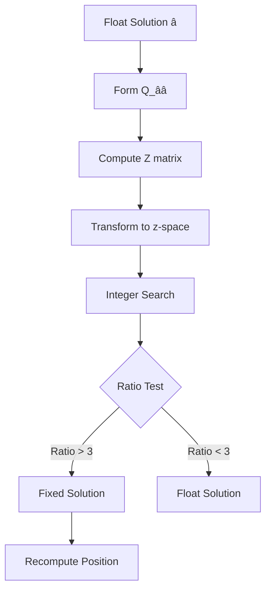

# Ambiguity Resolution

## Overview

**Ambiguity resolution** (AR) is the process of determining the integer number of carrier-phase cycles between a [[GPS|GNSS]] receiver and satellite. Resolving integer ambiguities is the key to achieving centimeter-level accuracy in [[RTK]] and [[PPP]] carrier-phase positioning. The most widely used method is LAMBDA (Least-squares AMBiguity Decorrelation Adjustment).

## The Ambiguity Problem

The carrier-phase observation equation:

$$\Phi = \rho + c(\delta t_u - \delta t^s) - I + T + \lambda N + \epsilon

$$ where:
- $\Phi $ = carrier-phase measurement (cycles)
- $\rho $ = geometric range (m)
- $\delta t_u, \delta t^s $ = receiver and satellite clock errors (s)
- $I$ = ionospheric delay (m)
- $T$ = tropospheric delay (m)
- $\lambda $ = carrier wavelength (m)
- $N$ = **integer ambiguity** (cycles) ← what we solve for
- $\epsilon $ = noise (m)

### Dual-Frequency Combination

For ionosphere-free combination:

$$\Phi_{LC} = \frac{f_1^2 \Phi_1 - f_2^2 \Phi_2}{f_1^2 - f_2^2} = \rho + c(\delta t_u - \delta t^s) + T + \lambda_{LC} N_{LC}

$$

## LAMBDA Method

### Mathematical Formulation

The float solution gives real-valued ambiguities $\hat{\mathbf{a}} $with covariance$ Q_{\hat{a}\hat{a}} $:

$$\min_{\mathbf{a} \in \mathbb{Z}^n} (\hat{\mathbf{a}} - \mathbf{a})^T Q_{\hat{a}\hat{a}}^{-1} (\hat{\mathbf{a}} - \mathbf{a})

$$

### Decorrelation Step

1. Apply Z-transform to decorrelate: $\hat{\mathbf{z}} = Z^T \hat{\mathbf{a}} $ 2.$Q_{\hat{z}\hat{z}} = Z^T Q_{\hat{a}\hat{a}} Z$ (near-diagonal)
3. Search in $\mathbf{z} $-space (much faster)
4. Back-transform: $\hat{\mathbf{a}} = Z^{-T} \hat{\mathbf{z}} $

### Search Strategy

## Validation: Ratio Test

The most common validation is the ratio test:

$$ R = \frac{\Delta\chi^2_2}{\Delta\chi^2_1} = \frac{\|\hat{\mathbf{a}} - \mathbf{a}_2\|^2_{Q^{-1}}}{\|\hat{\mathbf{a}} - \mathbf{a}_1\|^2_{Q^{-1}}} $$

| Ratio Value | Confidence | Decision |
|-------------|------------|----------|
| > 5 | Very high | Fix |
| 3–5 | High | Fix (with care) |
| 2–3 | Moderate | Float |
| < 2 | Low | Float |

## Ambiguity Resolution in Different Modes

| Mode | Baseline | Time to Fix | Key Challenge |
|------|----------|-------------|---------------|
| **[[RTK]] short baseline** | < 20 km | 5–30 s | Ionosphere |
| **[[RTK]] long baseline** | 20–100 km | 1–10 min | Ionosphere + troposphere |
| **Network RTK (VRS)** | Regional | 1–5 s | Reference station corrections |
| **[[PPP]]** | Any | 10–30 min | Convergence time |
| **Wide-lane AR** | Any | 5–15 min | Wide-lane wavelength (86 cm) |
| **Narrow-lane AR** | Any | 10–60 min | Narrow-lane wavelength (11 cm) |

## Wide-Lane and Narrow-Lane

### Wide-Lane Combination

$$ \lambda_{WL} = \frac{c}{f_1 - f_2} = \frac{c}{10.23 \text{ MHz}} \approx 86.19 \text{ cm}

$$

$$\Phi_{WL} = \Phi_1 - \Phi_2, \quad N_{WL} = N_1 - N_2

$$### Narrow-Lane Combination $$\lambda_{NL} = \frac{c}{f_1 + f_2} \approx 10.70 \text{ cm}

$$

$$ N_{NL} = N_1 + N_2 $$

## In [[Geodesy]] Context

### Indonesian CORS Applications
- **BIG CORS Network:** 200+ stations, network RTK with ambiguity fixing
- **Survey accuracy:** RTK with fixed ambiguity: 1–2 cm horizontal, 3–5 cm vertical
- **Long baseline:** GPS-only ambiguity resolution for [[Jaring Kontrol Geodesi|control points]] across islands

### Practical Tips for Better AR
1. **Observation time:** Minimum 15 min for short baselines, 30+ min for long
2. **Elevation mask:** 10–15° to reduce multipath
3. **Number of satellites:** ≥ 5 common satellites for reliable AR
4. **DOP values:** PDOP < 3 preferred
5. **Ionospheric activity:** Low solar activity improves AR success

## Study Problems

1. Explain why integer ambiguity resolution is necessary for carrier-phase positioning.
2. Compute the wide-lane wavelength for GPS L1 and L2 frequencies.
3. Why is the LAMBDA method faster than a brute-force search?
4. In what conditions does ambiguity resolution fail?

## Common Mistakes

1. **Fixing ambiguities when the ratio is too low** — leads to wrong position
2. **Not accounting for satellite geometry** — poor DOP degrades AR
3. **Assuming AR always succeeds** — ionospheric storms can prevent fixing
4. **Ignoring receiver/antenna calibration** — introduces systematic bias

## Related Concepts

- [[RTK]] — Real-Time Kinematic with AR
- [[PPP]] — Precise Point Positioning with AR
- [[Least Squares Adjustment]] — Foundation of LAMBDA
- [[GNSS]] — The measurement system
- [[GPS]] — Primary constellation
- [[Ambiguity Resolution#Wide-Lane|Ionosphere]] — Key error source

---

*Concept maintained by AIGIS — part of [[Geodesy MOC]]*
