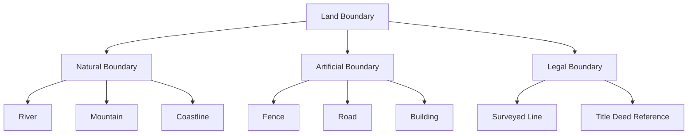

# Cadastral Surveying

## Overview

**Cadastral surveying** (Survei Kadastral) is the legal process of defining, recording, and certifying land boundaries for property rights. It combines [[Survei Terestris|terrestrial surveying]], [[GPS|GNSS positioning]], and legal frameworks. In Indonesia, cadastral surveys are conducted by BPN (Badan Pertanahan Nasional) under the Agrarian Law (UU No. 5/1960).

## Cadastral Survey Methods

### 1. Traditional (Raih Ukur)

| Method | Description | Accuracy |
|--------|-------------|----------|
| Angular measurement | Theodolite angles | ±5"–15" |
| Distance measurement | EDM or tape | ±0.01–0.05 m |
| Area calculation | Coordinate-based | ±1–5 m² |

### 2. GNSS-Based (Kadastral Modern)

| Method | Description | Accuracy |
|--------|-------------|----------|
| [[RTK]] survey | Real-time cm positioning | ±1–3 cm |
| Static GNSS | Post-processed | ±5 mm |
| Network RTK (VRS) | BIG CORS network | ±2–5 cm |

### 3. Combined (Hybrid)

- GNSS for primary control points
- Total station for detail survey
- Most common in Indonesian practice

## Indonesian Cadastral System

### Land Registration Types

| Type | Description | Authority |
|------|-------------|-----------|
| **Hak Milik (HM)** | Freehold ownership | BPN |
| **Hak Guna Bangunan (HGB)** | Right to build (30+20 yr) | BPN |
| **Hak Pakai (HP)** | Right to use | BPN |
| **Hak Sewa** | Leasehold | Private |

### Survey Standards (SNI)

| Standard | Description |
|----------|-------------|
| SNI 07-6989-2005 | Cadastral survey procedures |
| SNI 7387:2015 | Electronic instrument calibration |
| PP No. 18/2021 | Land management regulations |
| Permen ATR/BPN No. 18/2021 | Cadastral survey technical |

## Boundary Definition

### Boundary Types

### Boundary Monument

| Type | Material | Size | Purpose |
|------|----------|------|---------|
| **PT (Pasak Tanah)** | Iron | 50–100 cm | Corner marker |
| **Beton** | Concrete | 20×20×80 cm | Permanent marker |
| **Batu Nisan** | Stone | 30×30×50 cm | Traditional |
| **GPS marker** | Iron + GPS | 30 cm disc | Modern control |

## Coordinate System for Cadastral

Indonesian cadastral coordinates:
- **Reference:** [[WGS84]] (since 2014)
- **Grid:** UTM (zone appropriate)
- **Height:** Ellipsoidal or [[Orthometric Height]]
- **Previous:** DGN-95 (based on ITRF91/WGS84)

## Area Calculation

### Coordinate Method (Shoelace Formula)

$$

A = \frac{1}{2} \left| \sum_{i=1}^{n} (x_i y_{i+1} - x_{i+1} y_i) \right|

$$

### Simpson's Rule (for curved boundaries)

$$

A = \frac{h}{3}\left[y_0 + 4(y_1 + y_3 + \ldots) + 2(y_2 + y_4 + \ldots) + y_n\right]

$$

## In [[Geodesy]] Context

### Cadastral Survey Workflow

### Accuracy Requirements

| Survey Grade | Position Accuracy | Area Accuracy | Application |
|--------------|-------------------|---------------|-------------|
| **Primary** | ±2 cm | ±0.5 m² | Large estates |
| **Secondary** | ±5 cm | ±1.0 m² | Urban parcels |
| **Tertiary** | ±10 cm | ±5.0 m² | Rural parcels |

## Study Problems

1. Calculate the area of a parcel with coordinates $(500000, 9100000)$, $(500100, 9100000)$, $(500100, 9100100)$, $(500000, 9100100)$.
2. Explain the difference between Hak Milik and Hak Guna Bangunan.
3. Why is GNSS preferred over total station for cadastral control?

## Related Concepts

- [[Sistem Kadastral]] — Cadastral system
- [[Survei Kadastral]] — Practice course
- [[Penilaian Tanah dan Properti]] — Valuation
- [[Penetapan dan Penegasan Batas Wilayah]] — Boundary establishment
- [[GPS]] — Positioning method
- [[WGS84]] — Reference frame
- [[UTM]] — Grid system

---

*Concept maintained by AIGIS — part of [[Geodesy MOC]]*
