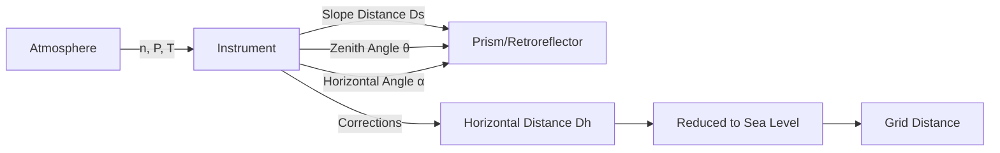

# EDM — Electronic Distance Measurement

## Overview

**EDM** (Electronic Distance Measurement) is the technology for determining the distance between two points using electromagnetic waves (microwave or infrared). Modern EDM devices are integrated into [[Total Station]] instruments, which combine EDM, theodolite, and data recording. EDM is the primary measurement method in [[Least Squares Adjustment|traverse]] and [[Jaring Kontrol Geodesi|geodetic control]] surveys.

## Measurement Principle

EDM measures the **phase difference** between a transmitted and received signal. The wavelength $\lambda$ is determined by the carrier frequency $f$:

$$

\lambda = \frac{c}{f}

$$

where $c$ is the speed of light in vacuum ($299\,792\,458$ m/s).

### Phase Measurement

The measured phase difference $\Delta\phi$ is:

$$

\Delta\phi = \frac{2\pi s}{\lambda} \mod 2\pi

$$

where $s$ is the slope distance. The **fractional distance** is:

$$

s_{frac} = \frac{\Delta\phi}{2\pi} \cdot \lambda

$$

### Carrier Frequencies

| Band | Frequency | Wavelength | Medium | Typical Range |
|------|-----------|------------|--------|---------------|
| **K (K-band)** | 24.150 GHz | 12.42 mm | IR | 1.5–5 km |
| **I (Infrared)** | 195 THz | 1.53 μm | IR | 2–5 km |
| **X (Microwave)** | 1.227 GHz | 24.45 cm | Microwave | 10–30 km |
| **L (Microwave)** | 1.227 GHz | 24.45 cm | Microwave | 20–50 km |
| **U (Ultraviolet)** | 780 THz | 383 nm | UV | 1–3 km |

## Atmospheric Corrections

### Index of Refraction

The speed of light in air is reduced by the refractive index $n$:

$$

v = \frac{c}{n}

$$

$$

n - 1 = \frac{P}{\rho R T} \cdot \left(\alpha + \frac{\beta}{\lambda^2}\right)

$$

where $P$ is atmospheric pressure, $\rho$ is air density, $R$ is the gas constant, $T$ is temperature, and $\alpha$, $\beta$ are empirical constants.

### Edlén's Formula (Simplified)

$$

(n - 1) \times 10^6 = \frac{8342.13}{\lambda^2} \cdot \frac{P_{dry}}{T} + \frac{29025.5}{\lambda^2} \cdot \frac{P_{wet}}{T} \cdot \frac{e_w}{e_s}

$$

where:
- $\lambda$ is in micrometers
- $P_{dry}$ = dry atmospheric pressure (hPa)
- $P_{wet}$ = water vapor pressure (hPa)
- $T$ = temperature (K)
- $e_w$ = water vapor pressure
- $e_s$ = saturation vapor pressure

### Temperature Correction

$$

\Delta s_T = s \cdot \alpha_T \cdot (T - T_0)

$$

where $\alpha_T \approx 0.00003$ /°C for K-band instruments.

### Pressure Correction

$$

\Delta s_P = s \cdot \alpha_P \cdot (P - P_0)

$$

where $\alpha_P \approx 0.00027$ /hPa for K-band.

## Combined Atmospheric Correction

For K-band EDM (most common):

$$

\Delta s_{atm} = s \cdot \left[ k_1 \cdot (P - 1013.25) - k_2 \cdot (T - 20) + k_3 \cdot (e - 7.5) \right]

$$

| Coefficient | K-band | I-band | L-band |
|-------------|--------|--------|--------|
| $k_1$ (pressure) | 0.27 ppm/hPa | 0.00 ppm/hPa | 0.00 ppm/hPa |
| $k_2$ (temperature) | 0.03 ppm/°C | 0.36 ppm/°C | 0.00 ppm/°C |
| $k_3$ (humidity) | 0.00 ppm/% | 0.00 ppm/% | 0.00 ppm/% |

## Instrument Specifications

### Typical EDM Accuracy

| Instrument Class | Accuracy (1σ) | Typical Use |
|------------------|---------------|-------------|
| **Sub-millimeter** | ±0.5 mm + 1 ppm | [[Geoid]] modeling, scientific |
| **Precision** | ±1 mm + 1 ppm | [[Jaring Kontrol Geodesi|Geodetic control]] |
| **Professional** | ±2 mm + 2 ppm | [[Survei Terestris|Construction survey]] |
| **Standard** | ±3 mm + 3 ppm | General surveying |
| **Economy** | ±5 mm + 5 ppm | Rough construction |

### Total Station Accuracy

| Component | Accuracy |
|-----------|----------|
| Horizontal angle | ±2"–15" |
| Vertical angle | ±2"–15" |
| EDM (K-band) | ±1–5 mm + 1–5 ppm |
| Prism constant | ±0–3 mm |
| Battery life | 8–20 hours |
| Operating range | 1.5–5 km (prism), 300–1000 m (reflective tape) |

## Slope to Horizontal Reduction

### Horizontal Distance

$$

D_h = D_s \cdot \cos\theta

$$

where $D_s$ is the slope distance and $\theta$ is the zenith angle.

### Combined with Curvature and Refraction

$$

D_h = D_s \cdot \cos\theta \cdot \left(1 + \frac{D_s}{2R}\right)

$$

where $R = 6\,371\,000$ m is Earth's mean radius.

### Orthometric Correction (for long sights)

$$

D_{ortho} = D_h \cdot \left(1 - \frac{H}{R}\right)

$$

where $H$ is the [[Orthometric Height]].

## Measurement Geometry

## In [[Geodesy]] Context

### EDM in Control Surveys
- **First-order control:** Requires sub-mm accuracy; uses calibrated prisms
- **Second-order control:** mm-level accuracy; standard prisms
- **Construction survey:** cm-level accuracy; mini prisms

### Indonesian Standards (SNI)
| Standard | Accuracy Requirement |
|----------|----------------------|
| SNI 07-6989-2005 | EDM calibration procedures |
| SNI 19-6705-2005 | Total station specifications |
| SNI 7387:2015 | Electronic theodolite standards |

### Prism Constants
| Prism Type | Constant (mm) |
|------------|---------------|
| Leica GRZ122 | 0 |
| Leica GR212 | 0 |
| Topcon AT-B | 0 |
| Custom (metal) | -2 to +3 |

## Study Problems

1. Given $D_s = 1500.000$ m, $\theta = 95°$, compute $D_h$.
2. If temperature is 30°C and pressure is 1000 hPa, compute the EDM correction for K-band.
3. Explain why EDM accuracy degrades with longer distances.
4. Compute the combined atmospheric correction for $s = 2$ km, $T = 25°C$, $P = 1010$ hPa.

## Common Mistakes

1. **Neglecting atmospheric corrections** — can cause 5–20 ppm errors (10–40 cm/km)
2. **Using wrong prism constant** — introduces systematic bias
3. **Not checking for obstruction** — multipath errors from reflective surfaces
4. **Ignoring Earth curvature** — significant for long-distance measurements (>5 km)
5. **Mixing slope and horizontal distances** — always reduce before plotting

## Related Concepts

- [[Total Station]] — Integrated EDM + theodolite
- [[Least Squares Adjustment]] — Processing EDM measurements
- [[Geodetic Coordinates]] — Final output of EDM surveys
- [[Orthometric Height]] — Used in reduction
- [[Jaring Kontrol Geodesi]] — Control network surveys
- [[WGS84]] — Reference frame for coordinates
- [[Transverse Mercator]] — Projection for grid coordinates

---

*Concept maintained by AIGIS — part of [[Geodesy MOC]]*
