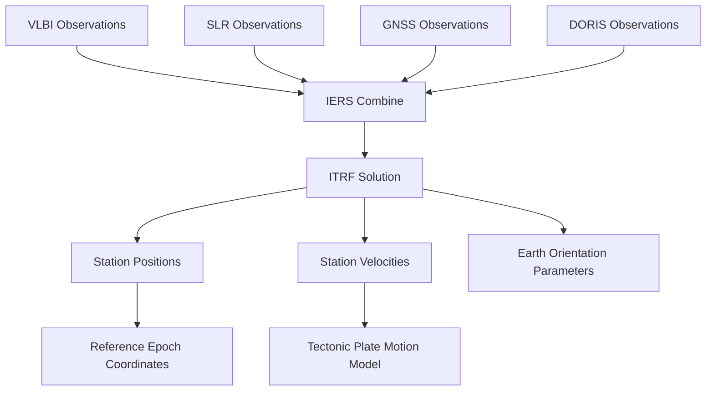

# ITRF — International Terrestrial Reference Frame

## Overview

**ITRF** (International Terrestrial Reference Frame) is the most accurate realization of the International Terrestrial Reference System (ITRS), maintained by [[IERS]]. It defines a Cartesian coordinate frame at Earth's surface, tied to the mass center of the entire Earth system (geocenter). ITRF is the foundation for all modern [[Datum|datums]] and is updated approximately every 5 years.

## Current Realizations

| Realization | Epoch | Reference | Accuracy | Key Improvement |
|-------------|-------|-----------|----------|-----------------|
| ITRF2008 | 2005.0 | [[GRS80]] ellipsoid | ~1 mm | VLBI + SLR + GNSS + DORIS |
| ITRF2014 | 2010.0 | [[GRS80]] ellipsoid | < 1 mm | Post-seismic deformation models |
| ITRF2020 | 2015.0 | [[GRS80]] ellipsoid | < 0.5 mm | Improved station velocity fields |

## Observation Techniques

| Technique | Observable | Accuracy | Network Size |
|-----------|------------|----------|--------------|
| **VLBI** | Radio source positions | ~1 mm | ~30 stations |
| **SLR** | Satellite range | ~1 mm | ~40 stations |
| **GNSS** | Carrier phase | ~1 mm | ~500 stations |
| **DORIS** | Satellite Doppler | ~1 mm | ~250 stations |

### How ITRF is Built

## Transformation Between ITRF Realizations

The standard 14-parameter Helmert transformation relates two ITRF realizations:

$$\begin{pmatrix} X \\ Y \\ Z \end{pmatrix}_{target} = \begin{pmatrix} T_1 \\ T_2 \\ T_3 \end{pmatrix} + (1+D) \begin{pmatrix} 1 & -R_3 & R_2 \\ R_3 & 1 & -R_1 \\ -R_2 & R_1 & 1 \end{pmatrix} \begin{pmatrix} X \\ Y \\ Z \end{pmatrix}_{source}

$ $

$$+ \dot{T} \cdot \Delta t + \dot{D} \cdot \Delta t \cdot \mathbf{r}_{source} + \dot{R} \cdot \Delta t \times \mathbf{r}_{source}

$ $

### Parameters (ITRF2014 → ITRF2008 Example)

| Parameter | Value | Unit | Rate | Unit/yr |
|-----------|-------|------|------|---------|
| $ T_1 $ | 0.0021 | m | $\dot{T}_1 $ | 0.0003 |
| $ T_2 $ | 0.0091 | m | $\dot{T}_2 $ | 0.0006 |
| $ T_3 $ | 0.0057 | m | $\dot{T}_3 $ | -0.0014 |
| $ D $ | 0.36e-9 | — | $\dot{D} $ | 0.02e-9 |
| $ R_1 $ | -0.054 | mas | $\dot{R}_1 $ | 0.011 |
| $ R_2 $ | 0.051 | mas | $\dot{R}_2 $ | 0.003 |
| $ R_3 $ | -0.068 | mas | $\dot{R}_3 $ | 0.016 |

## ITRF and Tectonic Plates

ITRF station positions change due to plate motion. IERS maintains a plate motion model (NNR-ITRF2014):

$ $\mathbf{v}_{NNR} = \boldsymbol{\Omega}_{plate} \times \mathbf{r}

$$

where $\boldsymbol{\Omega}_{plate} $ is the angular velocity vector of the tectonic plate.

### Indonesia's Plate Motion

| Plate | Velocity (mm/yr) | Direction |
|-------|-------------------|-----------|
| Sunda Plate | 65–70 | North-northeast |
| Pacific Plate | 90–100 | West-northwest |
| Australian Plate | 65–70 | North-northeast |
| Eurasian Plate (stable) | 0 (reference) | — |

The Sunda arc collision produces deformation that makes Indonesia one of the most tectonically complex regions for [[Datum|geodetic datums]].

## In [[Geodesy]] Context

### Why ITRF Matters
1. All GNSS orbits (GPS, GLONASS, Galileo, BeiDou) are computed in ITRF
2. National [[Datum|datums]] are defined as ITRF realizations with epoch
3. Survey coordinates must be reduced to a common epoch for precise work

### ITRF vs [[WGS84]]
- ITRF is the **scientific standard** (highest accuracy)
- WGS84 is the **operational standard** (GPS broadcasting)
- Since WGS84 G2139, the two agree to < 1 cm

### Epoch Management

For precise surveys, reduce coordinates to the survey date:

$ $\mathbf{r}(t) = \mathbf{r}(t_0) + \mathbf{v} \cdot (t - t_0)

$$

For inter-island surveys in Indonesia, velocities of 50–70 mm/yr mean significant displacement between observation dates.

## Study Problems

1. Given a station on the Sunda Plate moving at 67 mm/yr, compute displacement over 10 years.
2. Why does ITRF need at least 4 different observation techniques?
3. Transform coordinates from ITRF2000 to ITRF2014 using the published parameters.
4. Explain why Indonesia's tectonic setting makes ITRF epoch management critical.

## Related Concepts

- [[IERS]] — Maintains ITRF
- [[WGS84]] — GPS realization
- [[ETRS89]] — European realization
- [[Plate Tectonics]] — Drives station velocities
- [[Datum]] — Practical realization of ITRF
- [[Geocentric Cartesian ECEF]] — ITRF coordinates
- [[Helmert Transformation]] — Math behind ITRF updates
- [[IGS]] — Provides GNSS-based ITRF realizations

---

*Concept maintained by AIGIS — part of [[Geodesy MOC]]*
