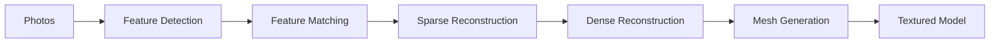

# Photogrammetry

## Overview

**Photogrammetry** is the science of making measurements from photographs, particularly aerial photographs. It extracts 3D information from 2D images using the collinearity condition. Modern photogrammetry uses digital sensors, [[GPS]] direct georeferencing, and structure-from-motion (SfM) algorithms. Key applications include topographic mapping, [[Model Terrain Digital|DEM generation]], and 3D city modeling.

## Fundamental Principle: Collinearity Condition

The collinearity equations relate image coordinates $(x, y) $ to object coordinates $ (X, Y, Z) $:

$ $  x - x_0 = -f \frac{m_{11}(X - X_L) + m_{12}(Y - Y_L) + m_{13}(Z - Z_L)}{m_{31}(X - X_L) + m_{32}(Y - Y_L) + m_{33}(Z - Z_L)}$$

$ $  y - y_0 = -f \frac{m_{21}(X - X_L) + m_{22}(Y - Y_L) + m_{23}(Z - Z_L)}{m_{31}(X - X_L) + m_{32}(Y - Y_L) + m_{33}(Z - Z_L)}$$

where:
- $ (x_0, y_0) $ = principal point (mm)
- $ f $ = focal length (mm)
- $ (m_{ij}) $ = rotation matrix from object to image system
- $ (X_L, Y_L, Z_L) $ = lens center coordinates
- $ (X, Y, Z) $ = ground point coordinates

## Camera Parameters

### Interior Orientation (IO)

| Parameter | Symbol | Typical Value | Determined by |
|-----------|--------|---------------|---------------|
| Focal length | $ f $ | 50–120 mm | Calibration |
| Principal point | $ (x_0, y_0) $ | 0 ± 0.01 mm | Calibration |
| Lens distortion | $ k_1, k_2, k_3 $ | Various | Calibration |
| Affinity | $ b_1, b_2 $ | 0 ± 1e-5 | Calibration |

### Distortion Model

$ $\Delta r = k_1 r^3 + k_2 r^5 + k_3 r^7 + b_1(r^2 + 2x^2) + 2b_2 xy

$$

where $ r = \sqrt{x^2 + y^2} $ is radial distance from principal point.

## Exterior Orientation (EO)

Six parameters per photograph: $ (X_L, Y_L, Z_L, \omega, \phi, \kappa) $

| Parameter | Description | Unit |
|-----------|-------------|------|
| $ X_L $ | Lens X coordinate | m |
| $ Y_L $ | Lens Y coordinate | m |
| $ Z_L $ | Lens Z coordinate (flying height) | m |
| $\omega $ | Roll angle | ° |
| $\phi $ | Pitch angle | ° |
| $\kappa $ | Yaw angle | ° |

## Photo Scale and Overlap

### Photo Scale

$ $  S = \frac{f}{H - h} = \frac{f}{\text{AGL}}$$

where $ H $= flight altitude and $  h $ = ground elevation.

### Overlap Requirements

| Type | Forward Overlap | Side Overlap | Purpose |
|------|----------------|--------------|---------|
| **Stereo** | 60% | 30% | 3D mapping |
| **Triangulation** | 60% | 30% | Control extension |
| **Orthophoto** | 60% | 30% | Mosaicking |
| **UAV mapping** | 70–80% | 60–70% | Dense reconstruction |

## Flight Planning

### Flying Height

$ $  H = h + \frac{f}{S} $ $### Ground Coverage $ $ \text{Width} = \frac{H \cdot w_{sensor}}{f}, \quad \text{Length} = \frac{H \cdot l_{sensor}}{f}

$$

# ## Number of Strips $ $ N_{strips} = \frac{\text{Project width} \times (1 - \text{side overlap})}{\text{Strip width}} + 1 $$

# # Digital Sensors

| Sensor Type | Resolution | swath | Typical Platform |
|-------------|------------|-------|------------------|
| Frame (digital) | 50–200 MP | 35–70 mm | Manned aircraft |
| Line scanner (pushbroom) | 1–100 Gpixels | 100–700 m | Manned aircraft |
| UAV frame | 12–100 MP | 10–40 mm | Drone |
| LiDAR + camera | Combined | 500–1500 m | Manned aircraft |

## Photogrammetric Products

| Product | Resolution | Application |
|---------|------------|-------------|
| Digital Orthophoto (DOQ) | 0.1–1.0 m | [[SIG]]/[[GIS]] mapping |
| Digital Elevation Model (DEM) | 1–5 m | [[Model Terrain Digital]] |
| Digital Surface Model (DSM) | 1–5 m | Urban modeling |
| Digital Terrain Model (DTM) | 1–5 m | Terrain analysis |
| 3D Point Cloud | 10–100 pts/m² | [[Model Terrain Digital]] |

## Structure from Motion (SfM)

## In [[Geodesy]] Context

### Topographic Mapping of Indonesia
- Rupabumi map series uses aerial photogrammetry
- 1:25,000 and 1:50,000 scales common
- [[Model Terrain Digital|DEM]] from photogrammetry used in flood mapping
- UAV photogrammetry increasingly used for cadastral surveys

## Study Problems

1. Compute the photo scale for $ f = 50 $ mm, flight altitude AGL = 3000 m.
2. Explain the collinearity condition in simple terms.
3. Calculate the ground coverage for a 50 MP sensor with $ f = 50 $ mm at $  H = 2000$ m.
4. Why are 60% forward overlap and 30% side overlap required for stereo?

## Related Concepts

- [[Model Terrain Digital]] — DEM products
- [[Remote Sensing]] — Broader field
- [[Map Projection]] — Georeferencing
- [[Least Squares Adjustment]] — Bundle adjustment
- [[Geodetic Coordinates]] — Ground coordinates
- [[GPS]] — Direct georeferencing
- [[Survei Kadastral]] — Cadastral applications

---

*Concept maintained by AIGIS — part of [[Geodesy MOC]]*
