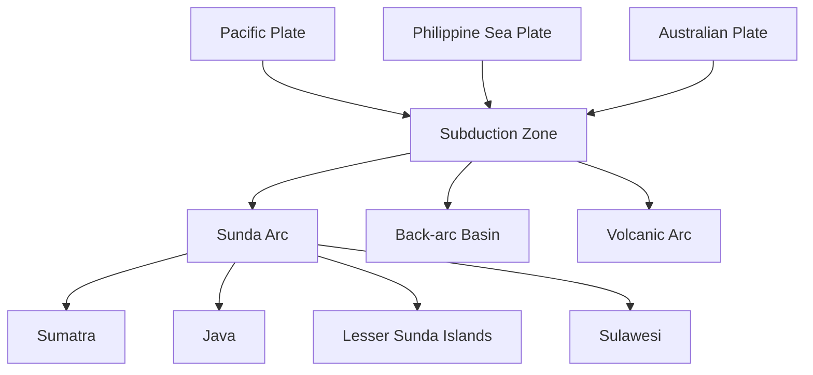

# Plate Tectonics

## Overview

**Plate tectonics** describes the large-scale motion of Earth's lithospheric plates over the asthenosphere. For geodesy, plate tectonics is critical because it drives [[Crustal Deformation]], makes [[ITRF|reference frame]] epoch management necessary, and affects the accuracy of [[Datum|geodetic datums]] in tectonically active regions like Indonesia.

## Plate Motion Models

### NUVEL-1A and MORVEL

| Plate | $\Omega$ (°/Myr) | Velocity at center (mm/yr) |
|-------|---------------------|----------------------------|
| Pacific | 0.958 | ~88 |
| Nazca | 0.734 | ~62 |
| North American | 0.208 | ~25 |
| South American | 0.113 | ~13 |
| Eurasian | 0.213 | ~22 |
| African | 0.212 | ~21 |
| Australian | 0.637 | ~57 |
| Antarctic | 0.890 | ~61 |
| Philippine Sea | 0.944 | ~70 |
| Sunda | ~0.58 | ~65 |

### Euler Pole Parameters

Plate motion is described by rotation about an Euler pole:

$$

\mathbf{v} = \boldsymbol{\Omega} \times \mathbf{r}

$$

| Plate Pair | Euler Pole Lat | Euler Pole Lon | Rate (°/Myr) |
|------------|----------------|----------------|--------------|
| Australian–Eurasian | -62.0° | 41.3° | 0.67 |
| Philippine Sea–Eurasian | -51.0° | -47.0° | 0.94 |
| Sunda–Eurasian | ~35.0° | 130.0° | ~0.00 (lock) |

## Indonesia's Tectonic Setting

### Major Plate Boundaries in Indonesia

| Type | Location | Rate | GPS Velocity |
|------|----------|------|-------------|
| Subduction | Sunda Trench | 50–70 mm/yr | ~67 mm/yr |
| Transform | Palu-Koro Fault | 20–40 mm/yr | ~35 mm/yr |
| Collision | Banda Arc | 20–30 mm/yr | ~25 mm/yr |
| Back-arc | Woodlark Basin | 50–80 mm/yr | ~70 mm/yr |
| Ridge | Banda Sea | 10–20 mm/yr | ~15 mm/yr |

### Indonesia GPS Network (SuGAR)

| Station | Plate | Velocity (mm/yr) |
|---------|-------|-------------------|
| COAB | Sunda | 65.2 N, 10.5 E |
| DAV0 | Philippine Sea | 93.0 N, 1.2 E |
| SOLO | Sunda | 63.4 N, 12.1 E |
| PNGA | Australian | 71.5 N, 2.3 E |

## Strain Rate and Seismic Hazard

$$

\dot{\epsilon}_{ij} = \frac{1}{2}\left(\frac{\partial v_i}{\partial x_j} + \frac{\partial v_j}{\partial x_i}\right)

$$

Maximum shear strain rate:

$$

\dot{\gamma}_{max} = \sqrt{\left(\frac{\dot{\epsilon}_{11} - \dot{\epsilon}_{22}}{2}\right)^2 + \dot{\epsilon}_{12}^2}

$$

## In [[Geodesy]] Context

### Deformation Monitoring
- **CORS networks** detect inter-seismic deformation
- **Campaign GNSS** measures strain accumulation
- **InSAR** provides spatial deformation maps
- See [[Crustal Deformation]] for detailed methods

### Implications for Datum
- Static [[Datum]] assumptions are **invalid** in Indonesia
- Must use epoch-dependent coordinates
- ITRF with velocities is essential for precise work

## Study Problems

1. Compute the horizontal velocity at Jakarta due to Sunda plate motion.
2. Explain why [[ITRF]] epoch management is critical for Indonesia.
3. Calculate the strain rate at a triple junction of 3 plates.

## Related Concepts

- [[Crustal Deformation]] — GPS-measured effects
- [[ITRF]] — Reference frame with velocities
- [[Datum]] — Tectonic implications
- [[Helmert Transformation]] — Transforming between frames
- [[GNSS]] — Primary measurement technique
- [[Indonesia]] — Tectonic setting

---

*Concept maintained by AIGIS — part of [[Geodesy MOC]]*
