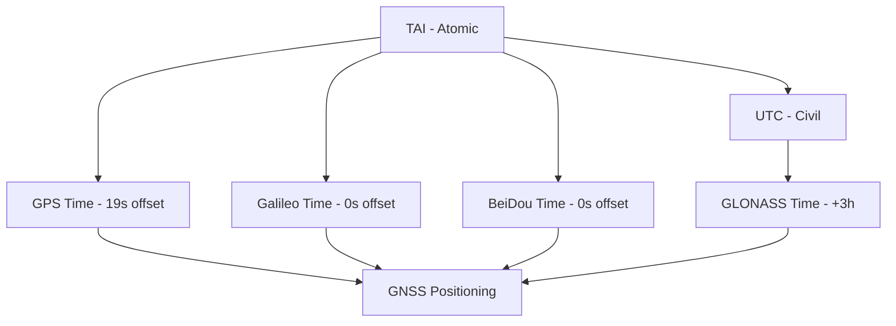

# Time Systems

## Overview

**Time Systems** in geodesy define the temporal reference frames used for [[GNSS]] positioning, celestial observations, and Earth rotation monitoring. Different systems serve different purposes: atomic time for precision, solar time for astronomy, and coordinated time for civil use. Understanding time systems is essential for [[GPS]], [[PPP]], and [[Geodetic Astronomy|geodetic astronomy]].

## Time Scales

### Atomic Time Scales

| Scale | Description | Offset from UTC |
|-------|-------------|-----------------|
| **TAI** | International Atomic Time — continuous atomic seconds | 0 (base) |
| **UTC** | Coordinated Universal Time — TAI with leap seconds | TAI - 37 s (as of 2024) |
| **GPS Time** | GPS satellite time — starts 1980-01-06, no leap seconds | TAI - 19 s = GPS epoch offset |
| **GLONASS Time** | Russian system time — UTC + 3 h | Same as UTC |
| **Galileo Time** | European system time — no leap seconds | Same as GPS Time |
| **BeiDou Time** | Chinese system time — no leap seconds | Same as GPS Time |

### Relationship Diagram

## GPS Time

GPS Time started at 00:00:00 UTC on January 6, 1980, and does not include leap seconds. As of 2024:

$$

\text{GPS Time} = \text{UTC} + 18 \text{ s}

$$

### GPS Week Number

GPS time is expressed as a week number and seconds-of-week:

$$

\text{GPS Week} = \text{floor}\left(\frac{\text{GPS seconds since epoch}}{604\,800}\right)

$$

$$

\text{Seconds of week} = \text{GPS seconds} \mod 604\,800

$$

### Week Number Rollover

GPS week number is transmitted as a 10-bit number (0–1023), causing rollover every 1024 weeks (~19.6 years):

| Rollover Event | Date |
|----------------|------|
| Week 0 | 1980-01-06 |
| Week 1023 | 1999-08-22 |
| Week 2047 | 2019-04-06 |
| Week 3071 | 2038-11-20 |

## Leap Seconds

Leap seconds are inserted into UTC to keep it within 0.9 s of UT1 (Earth-rotation-based time):

$$

\text{UTC} = \text{UT1} + \text{Leap Seconds}

$$

### Historical Leap Seconds

| Date | Leap Seconds | Cumulative |
|------|-------------|------------|
| 1972-06-30 | +10 | 10 |
| 1981-06-30 | +1 | 11 |
| 1982-06-30 | +1 | 12 |
| 1983-06-30 | +1 | 13 |
| 1985-12-31 | +1 | 14 |
| 1987-12-31 | +1 | 15 |
| 1989-12-31 | +1 | 16 |
| 1990-12-31 | +1 | 17 |
| 1992-06-30 | +1 | 18 |
| 1993-06-30 | +1 | 19 |
| 1994-06-30 | +1 | 20 |
| 1995-12-31 | +1 | 21 |
| 1997-06-30 | +1 | 22 |
| 1998-12-31 | +1 | 23 |
| 2005-12-31 | +1 | 24 |
| 2008-12-31 | +1 | 25 |
| 2012-06-30 | +1 | 26 |
| 2015-06-30 | +1 | 27 |
| 2016-12-31 | +1 | 28 |

Total as of 2024: **37 leap seconds**.

## UT1 and Earth Rotation

UT1 is astronomical solar time based on Earth's rotation:

$$

\text{UT1} = \text{UTC} + \text{UT1-UTC}

$$

The UT1-UTC difference is monitored by [[IERS]] and published in the IERS Bulletin A:

$$

\text{UT1-UTC} = -0.050\,868 \text{ s} \quad \text{(as of 2024-01-01)}

$$

### Greenwich Sidereal Time

$$

\theta = 24110.54841 + 8640184.812866 \cdot T + 0.093104 \cdot T^2 - 6.2e-6 \cdot T^3 \quad \text{(seconds)}

$$

where $T$ is Julian centuries since J2000.0.

## In [[Geodesy]] Context

### Time in GNSS Positioning

GPS pseudorange equation:

$$

\rho = c \cdot (\tau_{GPS} - t_{GPS}) + c \cdot \delta t_{sat} - c \cdot \delta t_{rec} + \epsilon_{ion} + \epsilon_{tropo}

$$

where $\tau_{GPS}$ is the signal transmission time in GPS Time.

### Time Conversion for Indonesian Surveys

| Local Time | UTC | GPS Time (2024) |
|------------|-----|-----------------|
| WIB (UTC+7) | UTC-7 | UTC+18 |
| WITA (UTC+8) | UTC-8 | UTC+18 |
| WIT (UTC+9) | UTC-9 | UTC+18 |

### Time Synchronization Requirements

| Survey Type | Required Accuracy |
|-------------|-------------------|
| [[Jaring Kontrol Geodesi|First-order control]] | ±1 ns (±30 cm) |
| [[Survei GNSS|RTK survey]] | ±10 ns (±3 m) |
| [[PPP]] | ±100 ns (±30 m) |
| [[Fotogrametri|Photogrammetry]] | ±1 μs (±300 m) |

## Study Problems

1. Convert GPS time 1245678900 s to UTC date and time.
2. Explain why GPS Time does not include leap seconds.
3. Compute the GPS week number and seconds-of-week for a given timestamp.
4. If UT1-UTC = -0.05 s, what is the error in solar time?

## Common Mistakes

1. **Confusing GPS Time and UTC** — always account for leap seconds
2. **Ignoring week number rollover** — can cause 20-year date errors
3. **Not synchronizing receiver clocks** — introduces pseudorange errors
4. **Using wrong time system for celestial observations** — UT1 needed for astronomy

## Related Concepts

- [[GPS]] — Uses GPS Time
- [[GNSS]] — All systems use their own time
- [[Geodetic Astronomy]] — Uses UT1
- [[PPP]] — Requires precise time
- [[IERS]] — Publishes UT1-UTC and leap seconds
- [[Celestial Coordinates]] — Time-dependent
- [[Precession and Nutation]] — Time-dependent Earth orientation

---

*Concept maintained by AIGIS — part of [[Geodesy MOC]]*
