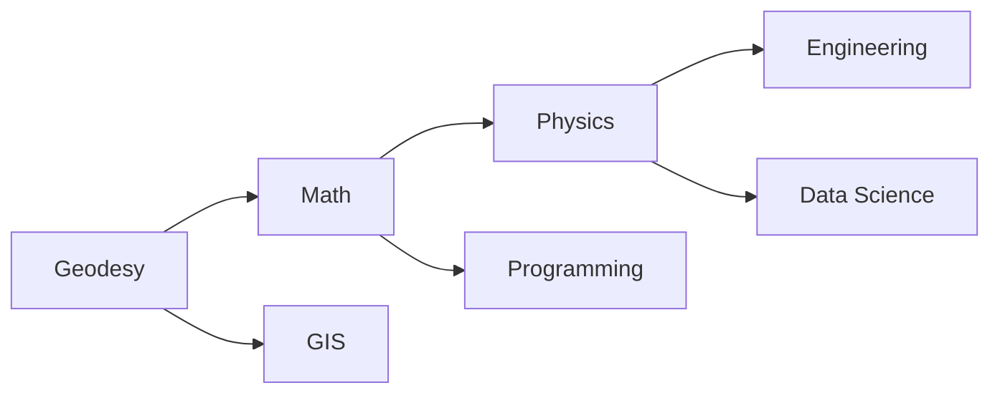

# 🌍 Geodesy — Knowledge Map of Content (MOC)

> *"The complete guide to understanding Earth's shape, position, and movement through advanced mathematical and physical principles."*

---

## 🎯 Vision

**Geodesy** is the science of Earth's geometric and dynamic properties. This MOC maps the complete journey from fundamental concepts to advanced applications, linking theory with practice in surveying, navigation, and positioning technologies.

---

## 📊 Subject Overview

### Core Domains

```mermaid
mindmap
 root((Geodesy Knowledge Base))
 Foundation
 🌐 [[Geodesy Fundamentals]]
 🏷️ [[Geodesy MOC|MOC Hub]]
 📚 [[Geodesy/Resources.md|Resources]]
 📅 [[Geodesy/Study Plan.md|Study Plans]]

 Coordinate Systems
 📏 [[Concepts/Geodetic Coordinates]]
 🎯 [[Concepts/Geodetic Coordinates]]
 🧭 [[Concepts/Local ENU NEU]]
 🌐 [[Curriculum/Semester 3|Semester 3]]

 Reference Frames
 🌍 [[Concepts/ITRF]]
 🏷️ [[Concepts/WGS84]]
 🧪 [[Concepts/GRS80]]
 🔄 [[Concepts/Precession and Nutation]]

 Measurement Science
 📡 [[Concepts/GNSS]]
 🔍 [[Concepts/GPS]]
 📊 [[Concepts/Least Squares Adjustment]]
 🔧 [[Concepts/EDM]]
 🌊 [[Concepts/RTK]]

 Applications
 🗺️ [[Concepts/Map Projection]]
 🧪 [[Concepts/Photogrammetry]]
 🏙️ [[Concepts/Cadastral Surveying]]
 🌊 [[Concepts/Hydrographic Surveying]]

 Geophysics
 🌡️ [[Concepts/Gravity Field]]
 🌊 [[Concepts/Geoid]]
 🔥 [[Concepts/Crustal Deformation]]
 🌿 [[Concepts/Plate Tectonics]]

 Curricula
 📚 [[Geodesy/Curriculum]]
 🎓 [[Geodesy/Curriculum/Semester 1|Semester 1]]
 🎓 [[Geodesy/Curriculum/Semester 2|Semester 2]]
 🎓 [[Geodesy/Curriculum/Semester 3|Semester 3]]
 🎓 [[Geodesy/Curriculum/Semester 4|Semester 4]]
 🎓 [[Geodesy/Curriculum/Semester 5|Semester 5]]
 🎓 [[Geodesy/Curriculum/Semester 6|Semester 6]]
 🎓 [[Geodesy/Curriculum/Semester 7|Semester 7]]
 🎓 [[Geodesy/Curriculum/Semester 8|Semester 8]]

 Research & Tools
 🔧 [[Geodesy/_Study Packs|Study Packs]]
 📝 [[Geodesy/_Inbox|Inbox]]
 🌐 [[Geodesy/Pilihan/README.md|Electives]]

---

## 🔗 Interlinked Structure

### Prerequisites

**Foundation → Intermediate → Advanced**

1. **Foundation**: Geodesy Fundamentals → Basic Mathematics
2. **Intermediate**: Coordinate Systems → GNSS Theory
3. **Advanced**: Geophysics → Applications

### Cross-References

- **Math Dependencies**: [[Mathematics/Concepts/Linear Algebra Fundamentals]]
- **Physics Connections**: [[Physics/Concepts/Newtonian Mechanics]]
- **Software Tools**: [[Geodesy/_Study Packs/Basic Geodesy]]

### Study Paths

```mermaid
flowchart LR
 A[New Student] --> B[Geodesy Fundamentals]
 B --> C[Coordinate Systems]
 C --> D[Reference Frames]
 D --> E[Measurement Science]
 E --> F[Applications]
 F --> G[Advanced Topics]
 G --> H[Research Projects]
 H --> I[Professional Practice]
```

---

## 📚 Key Content Categories

### 1. Core Concepts

| Concept | File | Description |
|---------|------|-------------|
| Overview | [[Geodesy MOC]] | Introduction to geodesy and its scope |
| Fundamentals | [[Geodesy/Concepts/Geodesy Fundamentals]] | Basic principles and history |
| Coordinate Systems | [[Geodesy/Concepts/Geodetic Coordinates]] | Mathematical framework |
| Reference Frames | [[Geodesy/Concepts/ITRF]] | International standards |
| GNSS | [[Geodesy/Concepts/GNSS]] | Global Navigation Satellite Systems |

### 2. Mathematical Framework

| Topic | File | Mathematics Connection |
|-------|------|----------------------|
| Least Squares | [[Geodesy/Concepts/Least Squares Adjustment]] | [[Mathematics/Concepts/Least Squares Adjustment]] |
| Matrix Factorization | [[Geodesy/Concepts/Helmert Transformation]] | [[Mathematics/Concepts/LU Decomposition]] |
| Error Analysis | [[Geodesy/Concepts/Error Propagation]] | [[Mathematics/Concepts/Error Propagation]] |
| Statistics | [[Concepts/ChiSquare]] | [[Mathematics/Concepts/ChiSquare]] |

### 3. Practical Applications

| Application | File | Related Physics |
|-------------|------|----------------|
| GNSS Surveying | [[Geodesy/Concepts/GNSS]] | [[Physics/Concepts/Electromagnetism & Signal Propagation]] |
| Map Projections | [[Geodesy/Concepts/Map Projection]] | [[Physics/Concepts/Optics & Atmospheric Refraction]] |
| Cadastral Survey | [[Concepts/Cadastral Surveying]] | [[Physics/Concepts/Quantum_Mechanics]] |
| Hydrographic | [[Concepts/Hydrographic Surveying]] | [[Physics/Concepts/Fluid_Mechanics]] |

---

## 🎓 Study Roadmap

### Short-Term (Weeks)

1. **Week 1-2**: Geodesy Fundamentals → Basic coordinate systems
2. **Week 3-4**: Reference frames → GNSS basics
3. **Week 5-6**: Measurement theory → Least squares introduction

### Medium-Term (Months)

4. **Month 3-4**: Applications → Surveying practice
5. **Month 5-6**: Geophysics → Data analysis

### Long-Term (Semester)

6. **Final Project**: Research/Professional practice
7. **Integration**: All concepts applied to real problems

---

## 🔍 Navigation Tips

### Quick Access

- **Start Here**: [[Geodesy MOC]] (current page)
- **Basic Concepts**: [[Geodesy/Concepts/Geodesy Fundamentals]]
- **Study Plans**: [[Geodesy/Study Plan.md]]
- **Resources**: [[Geodesy/Resources.md]]

### Learning Path

1. Read [[Geodesy MOC]] for overview
2. Progress through [[Geodesy/Concepts]] alphabetically
3. Use [[Geodesy/Curriculum]] as structured course guide
4. Consult [[Geodesy/Pilihan/README.md]] for electives
5. Review [[Geodesy/_Study Packs]] for focused studies
6. Check [[Geodesy/_Inbox]] for updates and notes

### Cross-Subject Learning



---

## 📬 Updates & Notes

### Recent Changes
- [ ] Semester 8 curriculum updated with thesis guidance
- [ ] New concept files added for GNSS and error analysis
- [ ] Enhanced cross-references and navigation

### Inbox
- [[Geodesy/_Inbox/Geodesy_Inbox.md]]
- [[Geodesy/_Inbox/_processed]]

---

## 🎯 Getting Started

### For Students

1. **Begin with**: [[Geodesy MOC]] (this page)
2. **Focus on**: [[Geodesy/Study Plan.md]] for semester-by-semester guidance
3. **Explore**: [[Geodesy/Concepts/Geodesy Fundamentals]] for foundation
4. **Practice**: Use [[Geodesy/_Study Packs]] for targeted learning

### For Instructors

1. **Use**: [[Geodesy/Curriculum]] as teaching materials
2. **Customize**: Adapt [[Geodesy/Concepts]] for specific courses
3. **Integrate**: Cross-links to related disciplines
4. **Update**: Regular maintenance of [[Geodesy/_Inbox]]

### For Professionals

1. **Quick reference**: [[Geodesy/Resources.md]] for external tools
2. **Applied focus**: Electives in [[Geodesy/Pilihan/README.md]]
3. **Research**: Explore [[Geodesy/_Study Packs]] for specialized topics
4. **Community**: Join through [[Geodesy/_Inbox]] for network

---

## 🌐 External Links

- **AIGIS Hub**: [[AIGIS Hub.md]]
- **Mathematics MOC**: [[Mathematics/Mathematics MOC.md]]
- **Physics MOC**: [[Physics/Physics MOC.md]]

---

## 📈 Next Development Steps

1. **Enhance**: Visual diagrams and illustrations for concepts
2. **Expand**: Research sections with recent papers and data
3. **Add**: Practical exercises and case studies
4. **Integrate**: Interactive elements for better learning

---

## 🔄 Version Control

**Last Updated**: 2026-07-27
**Status**: Active Development
**Version**: 1.0

---

*Page last updated: 2026-07-27 | AIGIS Content™*
📧 **Contact**: [[Geodesy/_Inbox/Geodesy_Inbox.md]] for feedback
🌐 **GitHub**: [[AIGIS Hub.md]] for repository navigation
📚 **Learning**: [[Geodesy/Study Plan.md]] for structured study path