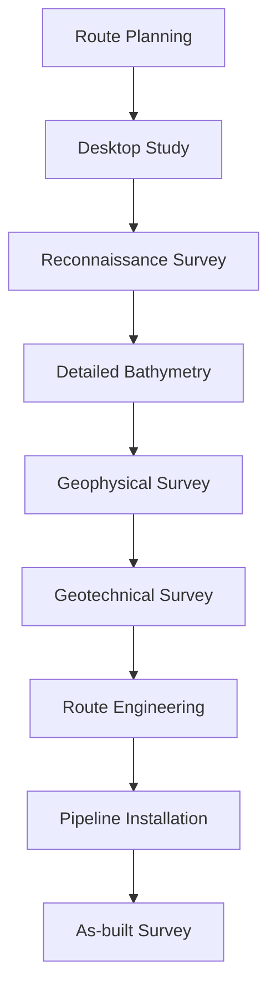

# Pilihan: Survei Rekayasa Laut (Marine Engineering Survey)

**Kode:** TKD213612 | **SKS:** 3 (2-1) | **Semester:** 5–6

## Course Overview

Marine Engineering Survey covers specialized hydrographic and geophysical survey techniques for offshore engineering applications including oil/gas exploration, pipeline and cable route surveys, dredging operations, and marine construction.

## Key Topics

### 1. Offshore Positioning

| Method | Accuracy | Application |
|--------|----------|-------------|
| **DGPS (Differential GPS)** | 1–3 m | General navigation |
| **RTK DGPS** | 2–5 cm | Construction, piling |
| **[[PPP]] (PPK)** | 5–10 cm | Remote offshore |
| **USBL (Ultra-Short Baseline)** | 0.1–1% depth | Underwater vehicle positioning |
| **LBL (Long Baseline)** | 1–10 cm | Subsea construction |

### 2. Marine Survey Instruments

| Instrument | Use | Frequency |
|-----------|-----|-----------|
| **MBES** (Multi-beam) | Bathymetric mapping | 200–400 kHz |
| **SSS** (Side-scan sonar) | Seafloor imagery | 100–500 kHz |
| **Sub-bottom profiler** | Subsurface sediments | 2–12 kHz |
| **Magnetometer** | Magnetic anomalies | 0.1–1 Hz |
| **ROV-mounted sensors** | Inspection | Various |

### 3. Pipeline/Cable Route Survey

### 4. Dredging Surveys

| Phase | Method | Purpose |
|-------|--------|---------|
| Pre-dredge | MBES + SSS | Volume computation |
| During dredging | Real-time DGPS | Guidance |
| Post-dredge | MBES | Quantity verification |

**Volume calculation:**

$$

V = \sum_{i=1}^{n} A_i \times d_i

$ $

where $ A_i $ is grid cell area and $ d_i$ is depth difference.

## Related Concepts

- [[Survei Hidrografi I]] — Hydrographic survey foundation
- [[Survei Hidrografi II]] — Advanced hydrography
- [[Pengelolaan Wilayah Pesisir]] — Coastal management
- [[GPS]] — Positioning

---

*Maintained by AIGIS — part of [[Geodesy MOC]]*
