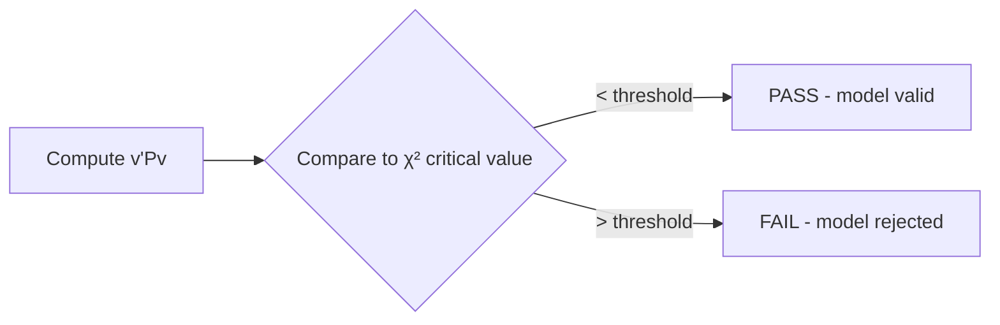

# Chi-Square (χ²) Distribution

> *"The workhorse of geodetic adjustment testing — from goodness-of-fit to residual analysis."*

---

## 1. Definition

If $Z_1, Z_2, \ldots, Z_n $are independent standard normal random variables, then:$$\chi^2_n = Z_1^2 + Z_2^2 + \cdots + Z_n^2

$$ has a **chi-square distribution** with $ n $ degrees of freedom.

### Parameters

| Symbol | Name | Value |
|--------|------|-------|
| $n$ or $k$ | Degrees of freedom | Positive integer |
| $f(x) = \frac{x^{n/2-1} e^{-x/2}}{2^{n/2} \Gamma(n/2)}$ | PDF | For $x > 0$ |

---

## 2. Properties

| Property | Formula |
|----------|---------|
| Mean | $E[\chi^2_n] = n$ |
| Variance | $\text{Var}[\chi^2_n] = 2n $ |
| Skewness | $\sqrt{8/n} $ |
| MGF | $M(t) = (1-2t)^{-n/2}$, $t < 1/2$ |
| Additivity | $\chi^2_m + \chi^2_n \sim \chi^2_{m+n} $ |

---

## 3. Key Relationships

### Fisher's Theorem

$$\frac{(n-1)S^2}{\sigma^2} \sim \chi^2_{n-1}

$$### Distribution as $ n \to \infty $

$$\frac{\chi^2_n - n}{\sqrt{2n}} \xrightarrow{d} \mathcal{N}(0,1) \quad (\text{CLT})

$$### Relationship to Gamma $$\chi^2_n \sim \text{Gamma}(n/2, 2)

$$

---

## 4. In Geodesy

### 4.1 Adjustment Quality Testing

In [[Least Squares Adjustment]], the quadratic form follows $\chi^2 $:

$$\Omega = \hat{v}^T P \hat{v} = v^T P v \sim \chi^2_{n-t}

$$ where $ n $= observations,$t$ = parameters.

### 4.2 Baarda Data Snooping

Test statistic for outlier detection:

$$ T_i = \frac{|w_i|}{\sqrt{(q_{w_i})}} \sim \mathcal{N}(0,1) $$ or equivalently:$$ \frac{w_i^2}{q_{w_i}} \sim \chi^2_1

$$

### 4.3 Model Validation

Test whether observed residuals match expected $\chi^2 $ distribution.

### 4.4 GNSS Cycle Slip Detection

Detect phase discontinuities using chi-square test on consecutive observations.

---

## 5. Critical Values Table

| $n$ (df) | $\chi^2_{0.05} $|$\chi^2_{0.01} $|$\chi^2_{0.005} $ |
|----------|-----------------|-----------------|-------------------|
| 1 | 3.841 | 6.635 | 7.879 |
| 2 | 5.991 | 9.210 | 10.597 |
| 5 | 11.070 | 15.086 | 16.750 |
| 10 | 18.307 | 23.209 | 25.188 |
| 20 | 31.410 | 37.566 | 39.997 |
| 30 | 43.773 | 50.892 | 53.672 |
| 50 | 67.505 | 76.154 | 79.490 |

---

## 6. Practical Example

In a geodetic adjustment with 20 observations and 3 parameters:

**Model:** $\chi^2_{17} $-$v^T P v = 15.2$, df = 17
- $\chi^2_{17, 0.05} = 27.587 $- Since $ 15.2 < 27.587$, **model passes** the goodness-of-fit test



---

## 7. Computing the χ² PDF (Python)

```python
import numpy as np
from scipy import stats

df = 17
x = np.linspace(0, 50, 1000)
pdf = stats.chi2.pdf(x, df)

# Critical values
alpha_05 = stats.chi2.ppf(0.95, df) # 27.587
alpha_01 = stats.chi2.ppf(0.99, df) # 33.409
```

---

## 8. References

- Koch, K.-R. (1999). *Parameter Estimation and Hypothesis Testing in Linear Models*. Springer.
- Teunissen, P. J. G. (2000). *Adjustment Theory*. Delft University Press.

See also: [[Hypothesis Testing]], [[Least Squares Adjustment]], [[Statistical Testing in Geodesy]]