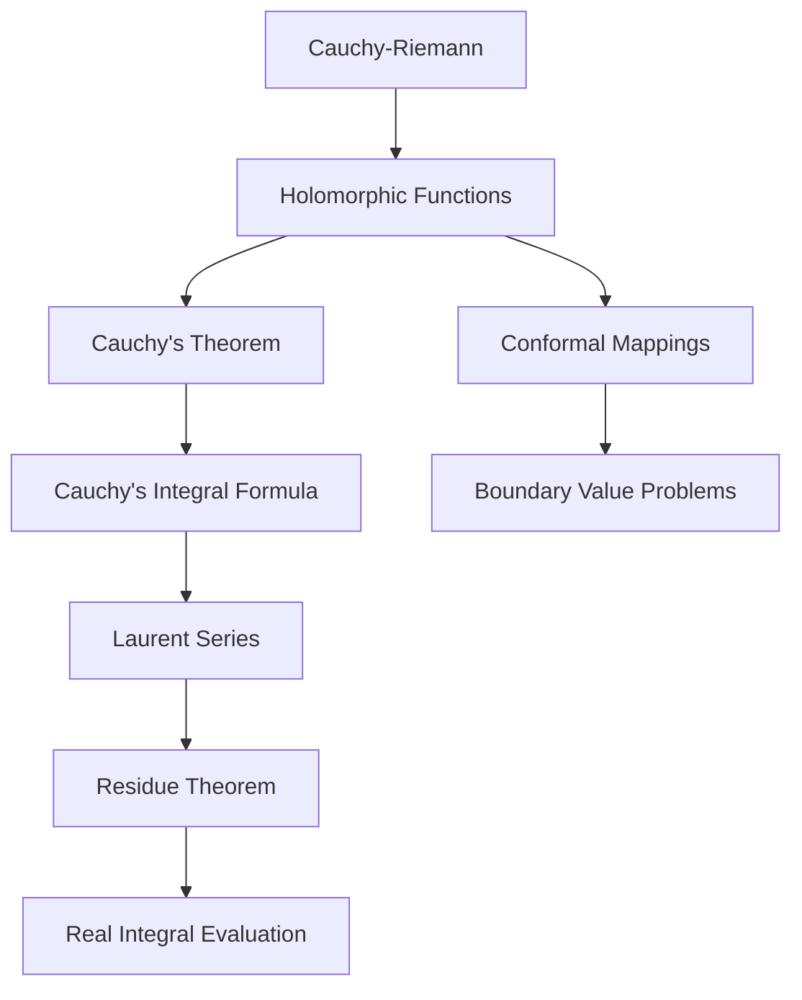

# Complex Analysis

> *"Complex analysis is arguably the most beautiful branch of mathematics."* — Visual Complex Analysis
> Part of [[Mathematics MOC]]. Essential for signal processing, fluid dynamics, and electromagnetic theory.

## 1. Complex Numbers

$z = x + iy $ where $ i^2 = -1 $, $ x = \text{Re}(z) $, $ y = \text{Im}(z) $.

### Polar and Exponential Form

$ $ z = r(\cos\theta + i\sin\theta) = re^{i\theta}$$

where $ r = |z| = \sqrt{x^2 + y^2} $, $\theta = \arg(z) = \arctan(y/x) $.

### Euler's Formula

$ $

e^{i\theta} = \cos\theta + i\sin\thet
a

$$**De Moivre's Theorem:**$ $(\cos\theta + i\sin\theta)^n = \cos(n\theta) + i\sin(n\theta)$$

### Roots of Unity
The $ n $-th roots of unity are $\omega_k = e^{2\pi i k/n} $ for $ k = 0, 1, \dots, n-1 $.

## 2. Analytic Functions

$ f(z) $ is **holomorphic** (analytic) at $ z_0 $ if $ f'(z_0) $ exists:

$ $ f'(z_0) = \lim_{\Delta z \to 0} \frac{f(z_0 + \Delta z) - f(z_0)}{\Delta z}$$

### Cauchy-Riemann Equations

If $ f(z) = u(x,y) + iv(x,y) $ is holomorphic

$ $\frac{\partial u}{\partial x} = \frac{\partial v}{\partial y}, \quad \frac{\partial u}{\partial y} = -\frac{\partial v}{\partial x} $$

This means $ u $ and $ v $ are **harmonic**: $\nabla^2 u = 0 $, $\nabla^2 v = 0 $.

## 3. Complex Integration

### Cauchy's Integral Theorem

If $ f $ is holomorphic in a simply connected domain $ D $ and $\gamma $ is a closed curve in $ D $:

$ $\oint_\gamma f(z) \, dz = 0

$$

### Cauchy's Integral Formula

If $ f $ is holomorphic inside and on a simple closed curve $\gamma $, and $ a $ is inside $\gamma $:

$ $

f(a) = \frac{1}{2\pi i} \oint_\gamma \frac{f(z)}{z - a} \, d
z

$$**Generalized form (nth derivative):**$ $ f^{(n)}(a) = \frac{n!}{2\pi i} \oint_\gamma \frac{f(z)}{(z-a)^{n+1}} \, dz $$

## 4. Series Expansions

### Taylor Series (analytic at $ z_0 $)

$ $

f(z) = \sum_{n=0}^{\infty} a_n (z - z_0)^n, \quad a_n = \frac{f^{(n)}(z_0)}{n!
}

$$### Laurent Series (annular region)$ $ f(z) = \sum_{n=-\infty}^{\infty} a_n (z - z_0)^n $$

The **residue** of $ f $ at $ z_0 $ is $\text{Res}(f, z_0) = a_{-1} $.

## 5. Residue Theorem

$ $\oint_\gamma f(z) \, dz = 2\pi i \sum_{k} \text{Res}(f, z_k)

$$

where the sum is over all singularities $ z_k $ inside $\gamma $.

### Computing Residues

For a **simple pole** ($ n=1 $):

$ $\text{Res}(f, z_0) = \lim_{z \to z_0} (z - z_0) f(z)

$$

For a **pole of order $ m $:**

$ $\text{Res}(f, z_0) = \frac{1}{(m-1)!} \lim_{z \to z_0} \frac{d^{m-1}}{dz^{m-1}} \left[ (z-z_0)^m f(z) \right]

$$

### Applications of the Residue Theorem

Evaluate real integrals:

$ $\int_{-\infty}^{\infty} \frac{dx}{x^2 + 1} = \pi, \quad \int_0^{\infty} \frac{\cos x}{x^2 + 1} \, dx = \frac{\pi}{e} $$## 6. Conformal Mappings $ f $ is **conformal** at $ z_0 $ if it preserves angles between curves. All holomorphic functions with $ f'(z_0) \neq 0 $ are conformal.

### Standard Mappings

| Mapping | Formula | Maps to |
|---------|---------|---------|
| **Möbius** | $ w = \frac{az+b}{cz+d} $ | Circles → circles |
| **Exponential** | $ w = e^z $ | Horizontal strips → half-planes |
| **Logarithm** | $ w = \log z $ | Sectors → strips |
| **Joukowski** | $ w = z + 1/z $ | Circles → airfoils |

## 7. Key Theorems

| Theorem | Significance |
|---------|-------------|
| **Maximum Modulus** | $|f| $ attains maximum on boundary (if not constant) |
| **Liouville** | Bounded entire functions are constant |
| **Fundamental Thm of Algebra** | Every polynomial has a root in $\mathbb{C} $ |
| **Argument Principle** | $\frac{1}{2\pi i}\oint \frac{f'}{f}dz = Z - P $ (zeros minus poles) |
| **Rouche's Theorem** | Counts zeros inside a contour |

## 8. Applications

| Field | Application |
|-------|-------------|
| **Signal Processing** | Z-transform, Laplace transform, filter design |
| **Fluid Dynamics** | Potential flow around airfoils (Joukowski transform) |
| **Electromagnetics** | Conformal mapping of field lines |
| **Quantum Mechanics** | Path integrals, analytic continuation |
| **Number Theory** | Riemann zeta function, prime distribution |

## Practice Problems

1. Verify Cauchy-Riemann equations for $ f(z) = z^3 $.
2. Compute $\oint_{|z|=2} \frac{e^z}{z^3} dz $ using Cauchy's formula.
3. Find all singularities and residues of $ f(z) = \frac{1}{z(z-1)(z+2)} $.
4. Evaluate $\int_0^\infty \frac{\cos x}{x^2 + 4} dx$ using residues.

## References

- Ahlfors, L.V. (1979). *Complex Analysis*. McGraw-Hill.
- Needham, T. (1997). *Visual Complex Analysis*. Oxford.
- Brown, J.W. & Churchill, R.V. (2013). *Complex Variables and Applications*. McGraw-Hill.

---
*See also: [[Differential Equations]], [[Fourier Analysis]], [[Linear Algebra Fundamentals]]*
