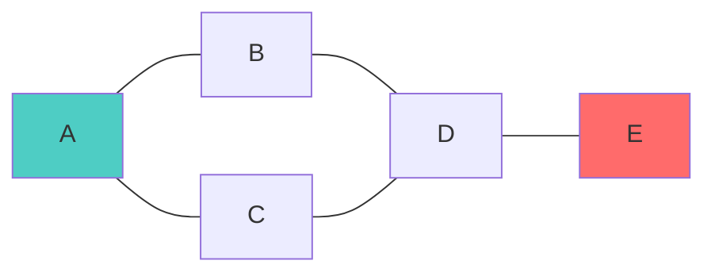
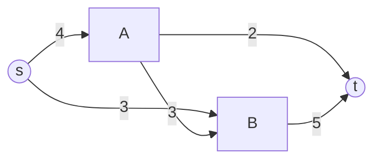

# Graph Theory

> *"A graph is a collection of dots and lines."* — Berge
> Part of [[Mathematics MOC]]. Essential for networks, routing, scheduling, and network topology analysis in geodesy.

## 1. Definitions

A **graph** $G = (V, E) $consists of a finite set of **vertices**$V $and a set of **edges**$E \subseteq V \times V$.

### Types of Graphs

| Type | Definition |
|------|-----------|
| **Undirected** | Edges have no direction: $\{u,v\} \in E \Leftrightarrow \{v,u\} \in E$ |
| **Directed (Digraph)** | Edges have orientation: $(u,v) \neq (v,u)$ |
| **Weighted** | Each edge $e $has a weight $w(e) \in \mathbb{R} $ |
| **Simple** | No loops, no multi-edges |
| **Complete** | Every pair of distinct vertices is connected: $K_n $has $\binom{n}{2} $ edges |
| **Bipartite** | $V = V_1 \cup V_2$, all edges go between $V_1 $and $V_2$ |

### Degree

The **degree** of vertex $v $is $\deg(v) = |\{e \in E : v \in e\}| $.

**Handshaking Lemma:**

$$\sum_{v \in V} \deg(v) = 2|E| $$

## 2. Paths and Connectivity

- A **path** is a sequence of distinct vertices $v_1, v_2, \dots, v_k $where $\{v_i, v_{i+1}\} \in E$.
- A **cycle** is a path where $v_1 = v_k $and $k \geq 3$.
- $G$ is **connected** if every pair of vertices has a path between them.



## 3. Trees

A **tree** is a connected acyclic graph. Key properties:
- $|E| = |V| - 1$
- There is exactly one path between any two vertices
- Every tree with $|V| \geq 2$ has at least two leaves (vertices of degree 1)

**Spanning Tree:** A subgraph that is a tree containing all vertices of $G$.

### Minimum Spanning Tree (MST)

Given a connected, weighted graph, find $T \subseteq E $that minimizes:$$w(T) = \sum_{e \in T} w(e)$$

| Algorithm | Strategy | Time Complexity |
|-----------|----------|----------------|
| **Kruskal's** | Greedy: sort edges, add if no cycle | $O(E \log E)$ |
| **Prim's** | Greedy: grow from a vertex | $O(E \log V)$ with heap |

## 4. Shortest Path Algorithms

```mermaid
flowchart TD
 Start[Shortest Path Problem] --> Neg{Negative weights?}
 Neg -->|No| Single{Single source?}
 Single -->|Yes| Dijkstra[Dijkstra's Algorithm]
 Single -->|No| Floyd[Floyd-Warshall: O\(V^3\)]
 Neg -->|Yes| Bellman[Bellman-Ford: O\(VE\)]
 Dijkstra --> |Non-negative weights| Result[\(d(s,v)\)]
```

| Algorithm | Time | Use Case |
|-----------|------|----------|
| **Dijkstra's** | $O((V+E)\log V)$ | Non-negative weighted graphs |
| **Bellman-Ford** | $O(VE)$ | Detects negative cycles |
| **Floyd-Warshall** | $O(V^3)$ | All-pairs shortest paths |
| **A\*** | Depends on heuristic | Heuristic search, pathfinding |

### Dijkstra's Algorithm

$$d(v) = \min_{u: (u,v) \in E} \left( d(u) + w(u,v) \right)$$Initialize $d(s) = 0$, $d(v) = \infty $for $v \neq s$.

## 5. Eulerian and Hamiltonian Paths

| Property | Eulerian | Hamiltonian |
|----------|----------|-------------|
| Traverses | Every edge exactly once | Every vertex exactly once |
| Exists when | All vertices have even degree (connected) | NP-complete to decide |
| Complexity | $O(E)$ — Fleury's/BHierholzer's | NP-hard (no polynomial algorithm known) |

## 6. Planar Graphs

A graph is **planar** if it can be drawn in the plane without edge crossings.

**Euler's Formula** for connected planar graphs:

$$V - E + F = 2$$where $F$ is the number of faces (including the outer face).

**Corollary:** For simple planar graphs with $V \geq 3$: $E \leq 3V - 6$.

## 7. Graph Coloring

**Vertex coloring:** Assign colors so that no two adjacent vertices share a color.

- **Chromatic number** $\chi(G)$: minimum colors needed
- $\chi(K_n) = n$-$\chi(\text{bipartite}) = 2$
- **4-Color Theorem:** Every planar graph is 4-colorable

## 8. Network Flow

**Max-Flow Min-Cut Theorem:** The maximum flow from source $s $to sink $t$equals the minimum capacity of an $s$-$t $cut.$$\max_{f} |f| = \min_{(S,T)} c(S,T)$$



## 9. Applications to Geodesy

| Concept | Application |
|---------|-------------|
| **MST** | Survey network design — minimum cost connectivity |
| **Shortest Path** | GNSS baseline network optimization |
| **Network Flow** | Data flow optimization in distributed survey systems |
| **Coloring** | Frequency assignment in communication networks |
| **Planarity** | Topology of geodetic control networks |

## 10. Key Theorems

1. **Handshaking Lemma:** $\sum \deg(v) = 2|E| $2. **Euler's Formula:**$V - E + F = 2$ (planar)
3. **Dirac's Theorem:** If $\deg(v) \geq |V|/2 $for all $v$, then $G$ has a Hamiltonian cycle
4. **König's Theorem:** In bipartite graphs, maximum matching = minimum vertex cover
5. **Ramsey's Theorem:** $R(s,t)$— in any 2-coloring of $K_n$, there exists a monochromatic $K_s $or $K_t$

## Practice Problems

1. Find a minimum spanning tree for a weighted survey network graph.
2. Apply Dijkstra's algorithm to find the shortest route through a GPS network.
3. Prove that $K_{3,3} $ is non-planar using Euler's formula.
4. Color a map of Indonesian provinces using the 4-color theorem.

## References

- West, D.B. (2001). *Introduction to Graph Theory*. Prentice Hall.
- Diestel, R. (2017). *Graph Theory* (5th ed.). Springer.
- Bondy, J.A. & Murty, U.S.R. (2008). *Graph Theory*. Springer.

---
*See also: [[Algorithms]], [[Linear Algebra Fundamentals]], [[Differential Equations]]*
