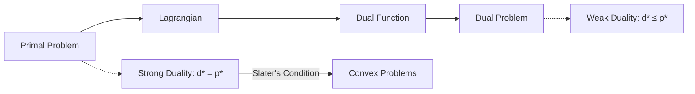

# Optimization Theory

> *"Optimization is the science of making the best possible decisions."* — Boyd & Vandenberghe
> Part of [[Mathematics MOC]]. Core to machine learning, control theory, surveying adjustment, and operations research.

## 1. Problem Classification

$$

\begin{aligned}
\text{minimize} \quad & f_0(x) \\
\text{subject to} \quad & f_i(x) \leq 0, \quad i = 1, \dots, m \\
& h_i(x) = 0, \quad i = 1, \dots, p
\end{aligned}

$$

| Category | Conditions |
|----------|------------|
| **Linear Programming (LP)** | $f_i$ linear, $x \in \mathbb{R}^n$ |
| **Quadratic (QP)** | $f_0$ quadratic, constraints linear |
| **Convex** | $f_i$ convex, $h_i$ affine |
| **Non-convex** | General nonlinear |
| **Integer** | $x_i \in \mathbb{Z}$ (MILP, MINLP) |

## 2. Convex Optimization

A function $f$ is **convex** if:

$$ f(\theta x + (1-\theta)y) \leq \theta f(x) + (1-\theta)f(y), \quad \forall x, y, \theta \in [0,1]$$

### Key Properties

- Local minimum = Global minimum for convex problems
- Any local minimizer of a convex function is a global minimizer
- Sublevel sets $\{x: f(x) \leq t\} $ are convex

### Common Convex Functions

| Function | Domain | Convex? |
|----------|--------|---------|
| $x^2$ | $\mathbb{R} $ | Yes |
| $e^x$ | $\mathbb{R} $ | Yes |
| $-\log x $|$\mathbb{R}_{++} $ | Yes |
| $\|x\|_p $ ($p \geq 1$) | $\mathbb{R}^n $ | Yes |
| $x^T P x$ ($P \succeq 0$) | $\mathbb{R}^n $ | Yes |

## 3. Unconstrained Optimization

### First-Order Necessary Condition

If $ x^*$is a local minimizer and $ f $is differentiable:$$\nabla f(x^*) = 0

$$

### Second-Order Conditions

- **Necessary:** $\nabla^2 f(x^*) \succeq 0 $ (positive semidefinite)
- **Sufficient:** $\nabla f(x^*) = 0 $and $\nabla^2 f(x^*) \succ 0 $ (positive definite)

### Gradient Descent

$$ x_{k+1} = x_k - \alpha_k \nabla f(x_k)$$

```mermaid
flowchart TD
 Init[Initialize x₀] --> Check{∇f(x) = 0?}
 Check -->|No| Step[x ← x - α∇f(x)]
 Step --> Check
 Check -->|Yes| Converge[Converged]

 subgraph Line Search
 LS1[Exact: min f(x - α∇f)]
 LS2[Backtracking: Armijo]
 LS3[Constant step]
 end
```

**Convergence rates:**
- Convex, Lipschitz gradient: $O(1/k)$
- Strongly convex: Linear ($O(\rho^k)$, $\rho < 1 $)

### Newton's Method

$$ x_{k+1} = x_k - [\nabla^2 f(x_k)]^{-1} \nabla f(x_k)$$ Quadratic convergence near solution, but requires Hessian inversion.

## 4. Constrained Optimization

### Lagrange Multipliers (Equality Constraints)

Minimize $f(x)$ subject to $h(x) = 0$.

**Lagrangian:** $\mathcal{L}(x, \nu) = f(x) + \nu^T h(x) $

**KKT Conditions (Necessary):**
1. $\nabla_x \mathcal{L}(x^*, \nu^*) = 0 $ (stationarity)
2. $h(x^*) = 0$ (primal feasibility)

### KKT Conditions (Inequality Constraints)

For $f_i(x) \leq 0$:
1. **Stationarity:** $\nabla f_0(x^*) + \sum_i \lambda_i \nabla f_i(x^*) + \sum_j \nu_j \nabla h_j(x^*) = 0 $ 2. **Primal feasibility:**$f_i(x^*) \leq 0, \; h_j(x^*) = 0$ 3. **Dual feasibility:**$\lambda_i \geq 0 $ 4. **Complementary slackness:**$\lambda_i f_i(x^*) = 0 $



### Duality

**Dual function:** $g(\lambda, \nu) = \inf_x \mathcal{L}(x, \lambda, \nu)$

**Dual problem:** Maximize $g(\lambda, \nu)$ s.t. $\lambda \geq 0 $.

**Weak duality:** $ p^* \geq d^*$ always holds.

**Strong duality:** $ p^* = d^*$ for convex problems satisfying Slater's condition.

## 5. Linear Programming

**Standard form:**

$$

\begin{aligned}
\text{minimize} \quad & c^T x \\
\text{subject to} \quad & Ax = b \\
& x \geq 0
\end{aligned}

$$

### Simplex Method

Moves along vertices of the feasible polyhedron. Polynomial-time in practice, exponential worst-case.

### Interior Point Methods

Follow the central path through the interior. Polynomial-time ($O(\sqrt{n} L)$).

### Duality in LP

Primal: min $c^T x$, s.t. $Ax = b, x \geq 0$
Dual: max $b^T y$, s.t. $A^T y \leq c$

## 6. Geodesy Applications

| Problem | Optimization Formulation |
|---------|--------------------------|
| **Least Squares Adjustment** | $\min \|Ax - b\|^2_{W} $ (weighted norm) |
| **Constrained Adjustment** | LS + equality constraints $Cx = d$ |
| **Network Design** | Minimize $\text{tr}(Q_{xx}) $ subject to budget |
| **Outlier Detection** | Minimize robust cost (Huber, Tukey) |
| **GNSS Integer Ambiguity** | Integer least squares (LAMBDA method) |

## 7. Gradient Descent Variants

| Method | Update | Best For |
|--------|--------|----------|
| **SGD** | $x_{k+1} = x_k - \alpha \nabla f_{i_k}(x_k)$ | Large-scale, ML |
| **Momentum** | $v = \beta v + \nabla f; x = x - \alpha v$ | Accelerating SGD |
| **Adam** | Adaptive moment estimation | Deep learning default |
| **L-BFGS** | Quasi-Newton, limited memory | Medium-scale smooth |

## Practice Problems

1. Solve $\min x^2 + y^2 $subject to $ x + y = 1 $ using Lagrange multipliers.
2. Derive the dual of $\min \|Ax - b\|^2 + \lambda \|x\|_1 $ (LASSO).
3. Show that $ f(x) = \log \sum e^{x_i}$ is convex.
4. Implement gradient descent for logistic regression.

## References

- Boyd, S. & Vandenberghe, L. (2004). *Convex Optimization*. Cambridge.
- Nocedal, J. & Wright, S.J. (2006). *Numerical Optimization*. Springer.
- Bertsekas, D.P. (2016). *Nonlinear Programming*. Athena Scientific.

---
*See also: [[Numerical Methods]], [[Linear Algebra Fundamentals]], [[Statistics]], [[Convex Analysis]]*
