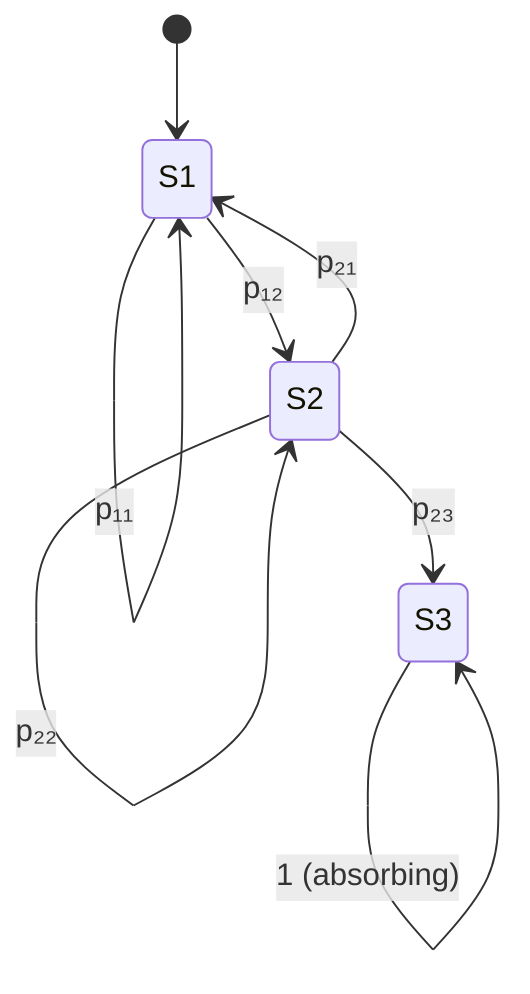

# Stochastic Processes

> *"A stochastic process is a collection of random variables indexed by time or space."* — Ross
> Part of [[Mathematics MOC]]. Essential for time series analysis, financial modeling, and signal processing.

## 1. Definitions

A **stochastic process** is a collection $\{X_t\}_{t \in T} $of random variables on a probability space$ (\Omega, \mathcal{F}, P) $.

| Index Set | Name | Example |
|-----------|------|---------|
| $T = \mathbb{Z}_{\geq 0}$ | Discrete-time | Random walks, Markov chains |
| $T = \mathbb{R}_{\geq 0}$ | Continuous-time | Brownian motion, Poisson process |
| $T$ = spatial | Spatial process | Random fields, Gaussian processes |

## 2. Markov Chains

### Discrete-Time Markov Chains (DTMC)

$X_{n+1}$ depends on $X_n$ only (memoryless):

$$ P(X_{n+1} = j \mid X_n = i, X_{n-1}, \dots, X_0) = P(X_{n+1} = j \mid X_n = i) = p_{ij}$$### Transition Matrix $$ P = \begin{bmatrix} p_{00} & p_{01} & \cdots \\ p_{10} & p_{11} & \cdots \\ \vdots & & \ddots \end{bmatrix}$$ where $ p_{ij} \geq 0 $and $\sum_j p_{ij} = 1 $.

### n-Step Transition

$$ P^{(n)} = P^n \quad \Rightarrow \quad p_{ij}^{(n)} = P(X_n = j \mid X_0 = i)$$

### Classification of States

| State Type | Property |
|-----------|----------|
| **Recurrent** | Returns to state $i$ with probability 1 |
| **Transient** | May never return |
| **Absorbing** | $p_{ii} = 1$ (once entered, stays) |
| **Positive recurrent** | Expected return time is finite |
| **Ergodic** | Aperiodic + positive recurrent |

### Stationary Distribution

$\pi $is **stationary** if $\pi P = \pi $ (i.e.,$\pi_j = \sum_i \pi_i p_{ij} $).

For irreducible aperiodic positive recurrent chains:

$$\lim_{n \to \infty} p_{ij}^{(n)} = \pi_j

$$### Mean Recurrence Time $$ m_{ii} = E[T_i] = \sum_{n=1}^{\infty} n \cdot P(T_i = n) = \frac{1}{\pi_i}$$

## 3. Poisson Process

### Definition

$\{N(t)\}_{t \geq 0} $is a Poisson process with rate $\lambda > 0 $ if:
1. $N(0) = 0$
2. **Independent increments:** $N(t+s) - N(t)$ independent of history
3. **Stationary increments:** $N(t+s) - N(t)$ has distribution $\text{Poisson}(\lambda s) $ 4. **No simultaneous arrivals:**$P(N(t+h) - N(t) > 1) = o(h)$### Key Properties

$$ P(N(t) = k) = \frac{(\lambda t)^k e^{-\lambda t}}{k!}$$

| Property | Formula |
|----------|---------|
| Mean | $E[N(t)] = \lambda t$ |
| Variance | $\text{Var}(N(t)) = \lambda t $ |
| Inter-arrival times | $\sim \text{Exp}(\lambda) $, i.i.d. |
| $n$-th arrival time | $S_n \sim \text{Gamma}(n, \lambda)$ |

## 4. Brownian Motion (Wiener Process)

$\{W_t\}_{t \geq 0} $ is a **standard Brownian motion** if:
1. $W_0 = 0$
2. **Independent increments:** $W_t - W_s$ independent of $W_u$ ($u \leq s$)
3. **Gaussian increments:** $W_t - W_s \sim N(0, t - s)$
4. **Continuous paths:** $t \mapsto W_t$ is continuous (a.s.)

### Properties

| Property | Formula |
|----------|---------|
| Mean | $E[W_t] = 0$ |
| Variance | $\text{Var}(W_t) = t $ |
| Quadratic variation | $[W]_t = t$ |
| Markov property | $P(W_{t+s} \in A \mid W_u, u \leq t) = P(W_{t+s} - W_t \in A)$ |

### Geometric Brownian Motion

$$ dS_t = \mu S_t \, dt + \sigma S_t \, dW_t $$ Solution:$ S_t = S_0 \exp\left(\left(\mu - \frac{\sigma^2}{2}\right)t + \sigma W_t\right) $

Foundation of **Black-Scholes** option pricing.

## 5. Martingales

$\{X_t\} $is a **martingale** with respect to filtration $\{\mathcal{F}_t\} $ if:
1. $E[|X_t|] < \infty$
2. $E[X_{t+1} \mid \mathcal{F}_t] = X_t$

### Optional Stopping Theorem

Under regularity conditions, $E[X_T] = E[X_0]$ for bounded stopping times $T$.

## 6. Applications

| Field | Application |
|-------|-------------|
| **Finance** | Black-Scholes, risk modeling, option pricing |
| **Biology** | Population genetics, epidemic modeling |
| **Queueing Theory** | Server capacity, wait times |
| **Geodesy** | GNSS positioning (kinematic Kalman filter) |
| **Physics** | Diffusion, statistical mechanics |
| **Networks** | Traffic modeling, reliability |

## 7. Connection to Kalman Filter (Geodesy)

The Kalman filter uses a **linear-Gaussian state-space model:**

$$ x_t = F_t x_{t-1} + w_t, \quad w_t \sim N(0, Q_t)$$

$$ z_t = H_t x_t + v_t, \quad v_t \sim N(0, R_t)$$

This is a discrete-time Gaussian Markov process, used extensively in GNSS positioning.

## Practice Problems

1. Find the stationary distribution of a 3-state Markov chain with given transition matrix.
2. Compute $P(N(3) = 5)$ for a Poisson process with rate $\lambda = 2 $.
3. Simulate Brownian motion and verify $ E[W_t^2] = t$.
4. Implement a Kalman filter for 1D position estimation.

## References

- Ross, S.M. (2014). *Introduction to Probability Models*. Academic Press.
- Karlin, S. & Taylor, H.M. (1975). *A First Course in Stochastic Processes*. Academic Press.
- Øksendal, B. (2003). *Stochastic Differential Equations*. Springer.

---
*See also: [[Probability Foundations]], [[Probability Distributions]], [[Descriptive Statistics]], [[Differential Equations]]*
