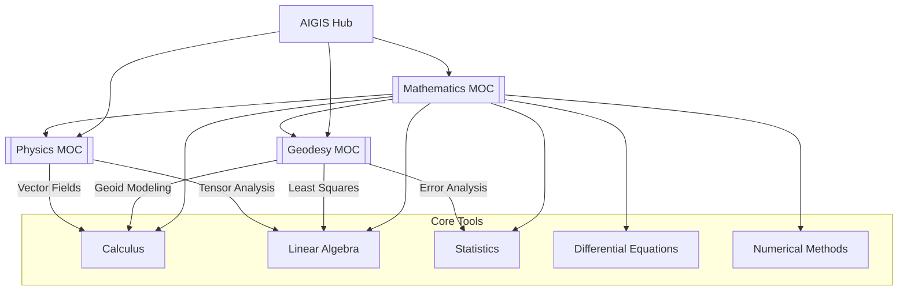
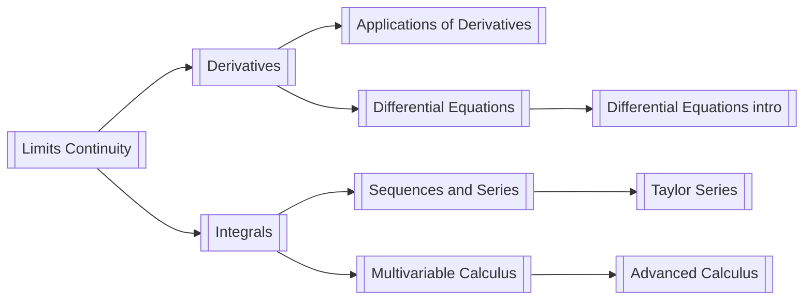
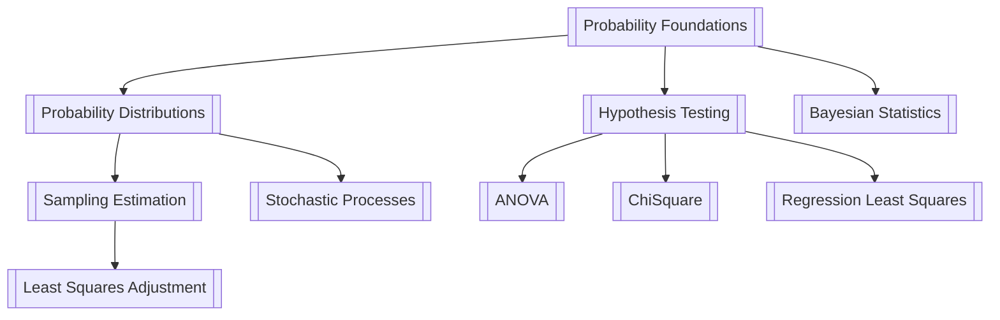
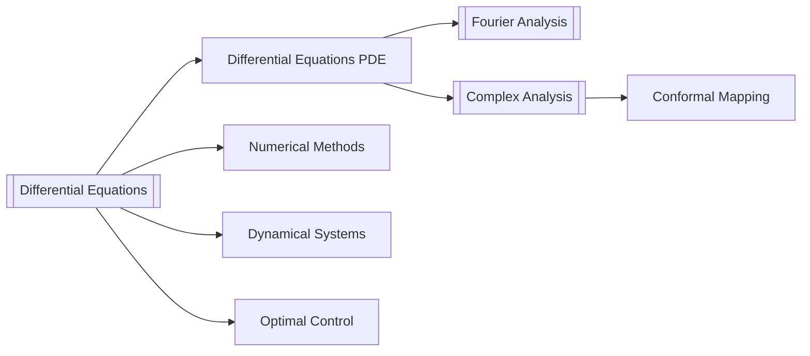
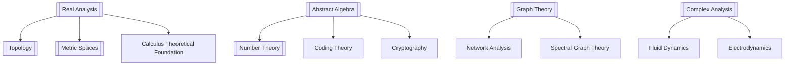

# 📐 MATHEMATICS — Knowledge Learning Genius

> *"Mathematics is the language with which God has written the universe."* — Galileo

Your **living Mathematics knowledge base**, built by AIGIS from your source documents and kept in sync to NotebookLM via Google Drive. Math is the backbone of geodesy — every formula, every computation, every model starts here.

## 🔗 Part of the bigger picture

➡️ [[AIGIS Hub]] · [[Physics MOC]] · [[Geodesy MOC]]

## 🧭 How to study with me

1. Start with the **Curriculum Guide** → [[Curriculum/Curriculum]] to see the full roadmap.
2. Follow the **Study Plan** → [[Study Plan]] for weekly structure.
3. Pick a **Concept Cluster** below to dive into theory.
4. Use **[[Math Concepts Index]]** to find any concept instantly.
5. Practice problems from each `Study Pack` in `_Study Packs/`.
6. Ask AIGIS on Telegram: *"explain eigenvalues like a tutor"*, *"derive the Fourier transform"*.

## 📚 Open-Access Resources (always fresh)

Curated bibliography of open-access textbooks (free and legal).
➡️ **[[Sources/Mathematics_Sources]]** — annotated with links

## 📅 Curriculum & Study Plan

➡️ [[Curriculum/Curriculum]] — Semester-by-semester alignment with UGM Geodesy
➡️ [[Study Plan]] — Weekly rhythm, milestones, progress tracking

## 🗺️ Knowledge-Machine Progression (Fundamentals → Advanced)

### 1. CALCULUS FOUNDATIONS

| Concept | Applications | Geodesy Link |
|---------|-------------|-------------|
| [[Limits Continuity]] | Foundation for all calculus | Convergence in iteration |
| [[Derivatives]] | Slope, rate, optimization | Gradient of terrain |
| [[Integrals]] | Area, volume, work | Volume of Earth features |
| [[Multivariable Calculus]] | Gradient, curl, divergence | Coordinate transformations |
| [[Sequences and Series]] | Fourier series, numerical approx | Spectral analysis |
| [[Taylor Series]] | Function approximation | Linearization in GNSS |

### 2. LINEAR ALGEBRA ENGINE

| Concept | Applications | Geodesy Link |
|---------|-------------|-------------|
| [[Linear Algebra Fundamentals]] | Vectors, matrices, determinants | Coordinate systems |
| [[LU Decomposition]] | Solving linear systems | Normal equations in LS |
| [[QR Factorization]] | Stable least squares | GNSS adjustment |
| [[Cholesky Decomposition]] | Positive definite systems | Covariance propagation |
| [[Error Propagation]] | Variance-covariance | Quality control in surveys |

### 3. STATISTICS & PROBABILITY

### 4. DIFFERENTIAL EQUATIONS

### 5. ADVANCED MATHEMATICS

### 6. OPTIMIZATION & NUMERICS

| Concept | Methods | Geodesy Application |
|---------|---------|-------------------|
| [[Optimization Theory]] | Gradient descent, Newton, KKT | Least squares, network design |
| [[Numerical Methods]] | Iteration, quadrature | Numerical integration for geoid |
| [[Bisection Method]] | Bracketing | Robust root-finding |
| [[Newton-Raphson Method]] | Quadratic convergence | Iterative LS adjustment |
| [[Least Squares Adjustment]] | Normal equations, SVD | ALL surveys, ALL adjustments |

## 🗺️ Concept Clusters

| Cluster | Core Concepts | Geodesy Applications |
|---------|---------------|----------------------|
| **Calculus** | Limits, derivatives, integrals, series, vector calculus | Kalkulus, Kalkulus Lanjutan, Multi-Variabel |
| **Linear Algebra** | Matrices, eigenvalues, SVD, optimization | Least Squares, coordinate transforms |
| **Statistics** | Probability, distributions, inference, hypothesis tests | Statistika Dasar, Analisis Statistika |
| **Differential Equations** | ODEs, PDEs, systems, boundary values | Dynamic systems (seismology) |
| **Numerical Methods** | Root-finding, integration, linear algebra | Numerical methods in surveying |
| **Advanced Math** | Abstract algebra, number theory, graph theory, topology | Cryptography, networks, spectral analysis |
| **Applied Math** | Optimization, complex analysis, Fourier analysis | Adjustments (GNSS, leveling), signal processing |

## 📚 Semester Overview

| Semester | Focus | Key Courses |
|----------|-------|-------------|
| **[[Semester 1/Semester 1]]** | Foundations | Calculus I, Linear Algebra, Statistics I |
| **[[Semester 2/Semester 2]]** | Core Techniques | Calculus II, ODEs, Advanced Linear Algebra |
| **[[Semester 3/Semester 3]]** | Advanced Methods | Vector Calculus, Real Analysis, Probability |
| **[[Semester 4/Semester 4]]** | Computational | Numerical Methods, Complex Analysis, Abstract Algebra |
| **[[Semester 5/Semester 5]]** | Applications | Numerical Methods Adv, Graph Theory, Optimization, AI, CV |
| **[[Semester 6/Semester 6]]** | Advanced Applications | Operations Research, Machine Learning, Simulation |
| **[[Semester 7/Semester 7]]** | Specialization | Multivariate Statistics, Deep Learning |
| **[[Semester 8/Semester 8]]** | Capstone | Final Project, Summary |

### Study Packs (in `_Study Packs/`)

| Pack | Courses Covered |
|------|----------------|
| [[Calculus for Engineers]] | All calculus (calc I, II, III, vector calc) |
| [[Linear Algebra for Surveying]] | Matrix methods, least squares |
| [[Statistics and Probability]] | Probability, statistics, inference |
| [[Differential Equations]] | ODEs, PDEs, applications |
| [[Numerical Methods]] | Root-finding, integration, ODE solvers |
| [[Optimization]] | All optimization theory and algorithms |
| [[Fourier Analysis]] | Fourier series, transform, applications |
| [[Complex Analysis]] | Analytic functions, residues, conformal mapping |
| [[Vector Calculus]] | Gradient, divergence, curl, integrals |
| [[Eigenvalues and Eigenvectors]] | Diagonalization, SVD, spectral theory |

## 📐 Key Mathematical Formulas for Geodesy

### Coordinate Transformations (Geodetic → ECEF)

$$

\\begin{aligned}
X &= (N + h)\\cos\\phi\\cos\\lambda \\
Y &= (N + h)\\cos\\phi\\sin\\lambda \\
Z &= (N(1-e^2) + h)\\sin\\phi
\\end{aligned}

$ $

where $ N = \\frac{a}{\\sqrt{1-e^2\\sin^2\\phi}} $, $ e^2 = 2f - f^2 $.

### Least Squares Normal Equations

$ $\\hat{x} = (A^T W A)^{-1} A^T W b, \\quad Q_{xx} = (A^T W A)^{-1}

$$

# ## Error Propagation $ $\\Sigma_z = J \\Sigma_x J^T

$$

# ## Stokes' Integral (Geoid) $ $ N(P) = \\frac{R}{4\\pi\\gamma} \\iint_\\sigma \\Delta g \\cdot S(\\psi) \\, d\\sigma $$

# # 📖 Recommended Textbooks (Free)

| Category | Resource |
|----------|----------|
| **Calculus** | OpenStax, MIT OCW, Khan Academy |
| **Linear Algebra** | Gilbert Strang, 3Blue1Brown |
| **Statistics** | OpenStax Introductory Statistics |
| **Numerical Methods** | Heath, Lindfield |
| **Machine Learning** | Bishop, Elements of Statistical Learning (free PDF) |
| **Deep Learning** | Goodfellow et al. (free online) |

## ▶️ How to use this MOC

1. **Before Course:** Preview the relevant concept index.
2. **During Course:** Link concepts as you encounter them.
3. **After Class:** Re-solved practice problems for mastery.
4. **Before Exam:** Open all concept notes + practice problems.
5. **When in Doubt:** Ask *"can you connect this geodesy problem to concept X?"*

---

**Quick Jump:**
[[Limits Continuity]] · [[Derivatives]] · [[Applications of Derivatives]] · [[Integrals]] · [[Multivariable Calculus]] · [[Linear Algebra Fundamentals]] · [[Probability Foundations]] · [[Probability Distributions]] · [[Differential Equations]] · [[Numerical Methods]] · [[Optimization Theory]] · [[Graph Theory]] · [[Complex Analysis]] · [[Real Analysis]] · [[Fourier Analysis]] · [[Abstract Algebra]] · [[Topology]] · [[Stochastic Processes]] · [[Metric Spaces]] · [[Number Theory]] · [[Least Squares Adjustment]] · [[Error Propagation]] · [[Taylor Series]] · [[Sequences and Series]] · [[LU Decomposition]] · [[QR Factorization]] · [[Cholesky Decomposition]] · [[Bisection Method]] · [[Newton-Raphson Method]] · [[Descriptive Statistics]] · [[Hypothesis Testing]] · [[Sampling Estimation]] · [[ANOVA]] · [[ChiSquare]] · [[Regression Least Squares]]

➡️ [[AIGIS Hub]] · [[Physics MOC]] · [[Geodesy MOC]]
