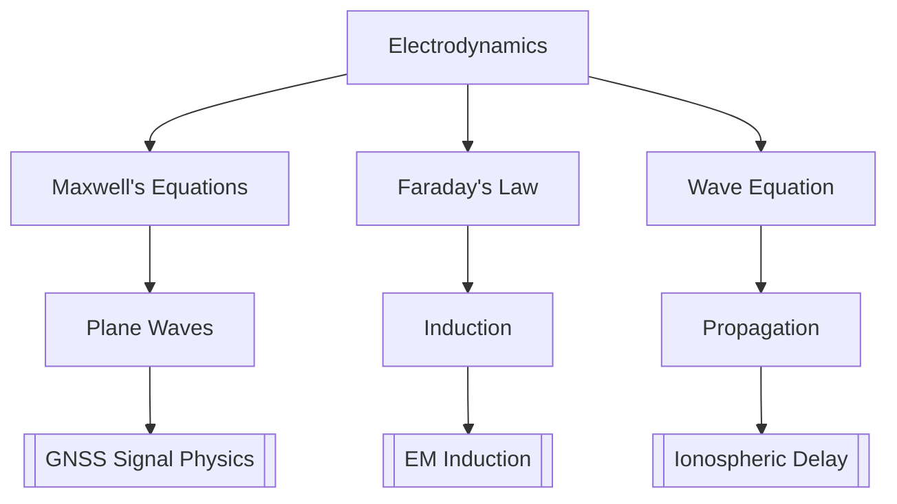

# Electrodynamics

> Faraday's law, Maxwell's equations, electromagnetic waves, Poynting vector

> **Part of:** [[Physics MOC]] · [[Physics_Curriculum_Guide]] · [[Study Plan]]

---

## 📚 Core Concept

> **Core idea in one sentence:** Electrodynamics unifies electricity and magnetism into a single theory of electromagnetic fields and their propagation as waves.

> **Geodesy Connection:** GNSS signals are electromagnetic waves; their propagation through ionosphere/troposphere requires full Maxwell theory.

---

## 🧮 Key Equations

### Maxwell's Equations (Differential Form)

$$

\begin{equation}
\nabla \cdot \mathbf{E} = \frac{\rho}{\varepsilon_0}
\end{equation}
\text{(Gauss's law for E)}

$$

$$

\begin{equation}
\nabla \cdot \mathbf{B} = 0
\end{equation}
\text{(Gauss's law for B)}

$$

$$

\begin{equation}
\nabla \times \mathbf{E} = -\frac{\partial \mathbf{B}}{\partial t}
\end{equation}
\text{(Faraday's law)}

$$

$$

\begin{equation}
\nabla \times \mathbf{B} = \mu_0\mathbf{J} + \mu_0\varepsilon_0\frac{\partial \mathbf{E}}{\partial t}
\end{equation}
\text{(Ampère-Maxwell law)}

**### Wave Equation & Poynting Vector **

\begin{equation}
\nabla^2 \mathbf{E} - \mu_0\varepsilon_0\frac{\partial^2 \mathbf{E}}{\partial t^2} = 0
\end{equation}
\text{(EM wave equation)}

$$

$$

\begin{equation}
\mathbf{S} = \frac{1}{\mu_0} \mathbf{E} \times \mathbf{B}
\end{equation}
\text{(Poynting vector)}

$$

$$

\begin{equation}
c = \frac{1}{\sqrt{\mu_0\varepsilon_0}} = 299,792,458 \text{ m/s}
\end{equation}
\text{(Speed of light)}

$$

---

## 🗺️ Concept Map

---

## 🔗 Links

- **Related:** [[Electrostatics]] · [[Magnetostatics]] · [[EM_Wave_Propagation]]
- **Geodesy:** [[Atmospheric_Physics]] · [[Relativistic_Applications]]
- **Study Pack:** [[_Study Packs/]]

*Last updated: 2026-07-27*