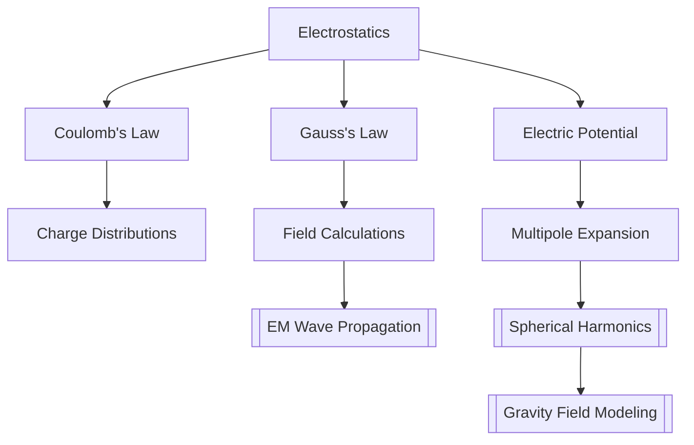

# Electrostatics

> Coulomb's law, Gauss's law, electric potential, multipole expansion, boundary conditions

> **Part of:** [[Physics MOC]] · [[Physics_Curriculum_Guide]] · [[Study Plan]]

---

## 📚 Core Concept

> **Core idea in one sentence:** Electrostatics governs the interaction of stationary electric charges via the electric field.

> **Geodesy Connection:** Signal propagation in GNSS instruments; electromagnetic sensors in gravimetry and magnetometry.

---

## 🧮 Key Equations

$$

\begin{equation}
\mathbf{F} = \frac{1}{4\pi\varepsilon_0}\frac{q_1q_2}{r^2}\hat{r}
\end{equation}
\text{(Coulomb's law)}

$$

$$

\begin{equation}
\nabla \cdot \mathbf{E} = \frac{\rho}{\varepsilon_0}
\end{equation}
\text{(Gauss's law, differential form)}

$$

$$

\begin{equation}
\oint_S \mathbf{E} \cdot d\mathbf{a} = \frac{Q_{\text{enc}}}{\varepsilon_0}
\end{equation}
\text{(Gauss's law, integral form)}

$$

$$

\begin{equation}
\mathbf{E} = -\nabla V
\end{equation}
\text{(Electric potential relation)}

$$

$$

\begin{equation}
V(\mathbf{r}) = \frac{1}{4\pi\varepsilon_0}\sum_{l=0}^{\infty}\frac{1}{r^{l+1}}\int (r')^l P_l(\cos\theta)\rho(\mathbf{r}')d^3r'
\end{equation}
\text{(Multipole expansion of potential)}

$$

---

## 🧭 Physical Intuition & Mental Models

> **Visual analogy:** Like field lines of a bar magnet — strength decreases with distance, lines spread out.

> **Key insight:** Gauss's law relates the flux through a closed surface to enclosed charge — powerful for symmetric problems.

> **Geodesy intuition:** Multipole expansion is the same mathematical framework used in spherical harmonic expansion of Earth's gravity field.

---

## 🗺️ Concept Map

---

## 🔗 Links

- **Related:** [[Electrodynamics]] · [[EM_Wave_Propagation]]
- **Geodesy:** [[Gravitational_Potential_Theory]] · [[Atmospheric_Physics]]
- **Study Pack:** [[_Study Packs/]]

*Last updated: 2026-07-27*