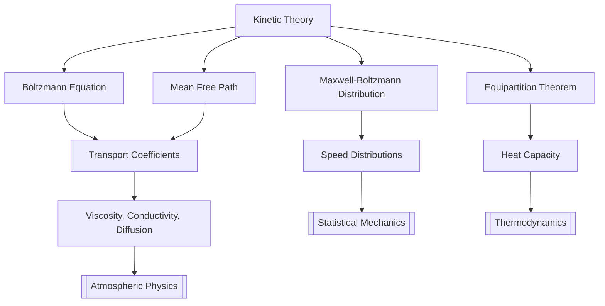

# Kinetic Theory (Teori Kinetik)

> Boltzmann equation, transport coefficients, H-theorem, equipartition theorem, mean free path

> **Part of:** [[Physics MOC]] · [[Physics_Curriculum_Guide]] · [[Study Plan]]

---

## 📚 Core Concept

> **Core idea in one sentence:** Kinetic theory describes the macroscopic thermodynamic properties of gases by analyzing the statistical behavior of large numbers of microscopic particles in random thermal motion.

> **Geodesy Connection:** Collisional transport in the ionosphere, neutral atmosphere modeling, error propagation in geodetic measurements, and pressure/temperature effects on GNSS signal propagation.

---

## 🧮 Key Equations

### Boltzmann Transport Equation

The Boltzmann equation governs the evolution of the phase-space distribution function $f(\mathbf{r}, \mathbf{v}, t)$, which gives the probability of finding a particle at position $\mathbf{r}$ with velocity $\mathbf{v}$ at time $t$:

$$
\frac{\partial f}{\partial t} + \mathbf{v} \cdot \nabla f + \frac{\mathbf{F}}{m} \cdot \nabla_v f = \left(\frac{\partial f}{\partial t}\right)_{\text{coll}}
$$

Here $\mathbf{F}$ is the external force, $m$ is the particle mass, and the right-hand side is the collision integral describing binary particle interactions.

### Ideal Gas Law from Kinetic Theory

The pressure $P$ exerted by an ideal gas arises from molecular collisions with container walls. The kinetic theory derivation yields:

$$
P = \frac{1}{3} n m \overline{v^2} = nk_BT
$$

where $n = N/V$ is the number density, $\overline{v^2}$ is the mean-square speed, $k_B$ is Boltzmann's constant, and $T$ is the absolute temperature.

### Root-Mean-Square Speed

The RMS speed of particles in a gas at temperature $T$ is:

$$
v_{\text{rms}} = \sqrt{\overline{v^2}} = \sqrt{\frac{3k_BT}{m}}
$$

### Most Probable Speed and Mean Speed

The Maxwell-Boltzmann speed distribution gives distinct characteristic speeds:

$$
v_{\text{mp}} = \sqrt{\frac{2k_BT}{m}} \quad \text{(most probable speed)}
$$

$$
\overline{v} = \sqrt{\frac{8k_BT}{\pi m}} \quad \text{(mean speed)}
$$

$$
v_{\text{rms}} = \sqrt{\frac{3k_BT}{m}} \quad \text{(RMS speed)}
$$

Note that $v_{\text{mp}} < \overline{v} < v_{\text{rms}}$, always.

### Equipartition Theorem (Teorema Pemisahan Merata)

Each quadratic degree of freedom contributes $\frac{1}{2}k_BT$ to the average energy:

$$
\langle E \rangle = \frac{f}{2} k_B T
$$

where $f$ is the number of quadratic degrees of freedom. For a monatomic gas $f=3$ (three translational), for diatomic $f=5$ (three translational plus two rotational).

### Mean Free Path (Lintas Bebas Rata-rata)

The average distance a particle travels between collisions is:

$$
\ell = \frac{1}{\sqrt{2}\, \pi d^2 n}
$$

where $d$ is the molecular diameter and $n$ is the number density. The mean free path relates to transport coefficients such as viscosity and thermal conductivity.

### Transport Coefficients

**Viscosity** (Viskositas):

$$
\eta = \frac{1}{3} n m \overline{v} \ell = \frac{1}{3}\sqrt{\frac{m k_BT}{\pi}} \cdot \frac{1}{\pi d^2}
$$

**Thermal Conductivity** (Konduktivitas Termal):

$$
\kappa = \frac{1}{3} n \overline{v} \ell \, c_V = \frac{c_V \eta}{m}
$$

**Diffusion Coefficient** (Koefisien Difusi):

$$
D = \frac{1}{3} \overline{v} \ell
$$

### H-Theorem

The $H$-function (negentropy) is defined as:

$$
H = \int f \ln f \, d^3v
$$

Boltzmann's $H$-theorem states $\frac{dH}{dt} \leq 0$, meaning the system evolves toward thermal equilibrium — the Boltzmann distribution — where $H$ reaches its minimum value.

---

## 🧭 Physical Intuition & Mental Models

> **Visual analogy:** Imagine a room full of ping-pong balls bouncing off walls and each other. No single ball's path matters — what matters is the statistical pattern of billions of collisions.

> **Key insight:** Temperature is fundamentally a measure of average translational kinetic energy: $\frac{1}{2}m\overline{v^2} = \frac{3}{2}k_BT$. Heat is energy in transit; pressure is momentum flux from molecular bombardment.

> **Geodesy intuition:** The atmosphere is not a continuum — it thins exponentially. At GNSS satellite altitudes (~20,200 km), the mean free path is enormous, and individual molecular collisions matter for drag calculations on low-Earth orbit satellites.

---

## 🧪 Worked Examples

### Example 1: RMS Speed of Nitrogen at Room Temperature

**Problem:** Calculate the root-mean-square speed of molecular nitrogen ($N_2$, mass $m = 4.65 \times 10^{-26}$ kg) at $T = 300$ K.

**Solution:**

Using the RMS speed formula:

$$
v_{\text{rms}} = \sqrt{\frac{3k_BT}{m}}
$$

Substituting values with $k_B = 1.381 \times 10^{-23}$ J/K:

$$
v_{\text{rms}} = \sqrt{\frac{3 \times 1.381 \times 10^{-23} \times 300}{4.65 \times 10^{-26}}}
$$

$$
v_{\text{rms}} = \sqrt{\frac{1.243 \times 10^{-20}}{4.65 \times 10^{-26}}} = \sqrt{2.673 \times 10^{5}} \approx 517 \text{ m/s}
$$

**Result:** Nitrogen molecules move at approximately 517 m/s at room temperature — faster than the speed of sound (~343 m/s), which makes sense since the speed of sound is a bulk propagation speed.

---

### Example 2: Mean Free Path in the Upper Atmosphere

**Problem:** Estimate the mean free path of air molecules at an altitude of 200 km, where the number density is approximately $n = 5 \times 10^{13}$ molecules/m³ and the effective molecular diameter is $d = 3.7 \times 10^{-10}$ m.

**Solution:**

Using the mean free path formula:

$$
\ell = \frac{1}{\sqrt{2}\, \pi d^2 n}
$$

$$
\ell = \frac{1}{\sqrt{2} \times \pi \times (3.7 \times 10^{-10})^2 \times 5 \times 10^{13}}
$$

$$
\ell = \frac{1}{1.414 \times 3.1416 \times 1.369 \times 10^{-19} \times 5 \times 10^{13}}
$$

$$
\ell = \frac{1}{3.036 \times 10^{-5}} \approx 3.3 \times 10^{4} \text{ m} = 33 \text{ km}
$$

**Result:** At 200 km altitude, the mean free path is about 33 km — far larger than the scale height of the atmosphere (~7 km). This means the atmosphere at this altitude is in the free molecular flow regime, critical for modeling satellite drag in low-Earth orbit.

---

## 🗺️ Concept Map

---

## 📚 References

| Source | Topic | URL |
|--------|-------|-----|
| MIT OCW 8.333 (Statistical Mechanics I) | Kinetic theory, Boltzmann equation, equipartition | https://ocw.mit.edu/courses/8-333-statistical-mechanics-i-statistical-mechanics-of-particles-fall-2013/ |
| OpenStax University Physics Vol. 2 | Kinetic theory of gases, ideal gas law derivation | https://openstax.org/books/university-physics-volume-2/pages/3-1-ideal-gas-law-and-kinetic-theory |
| HyperPhysics — Kinetic Theory | Speed distributions, mean free path, transport | http://hyperphysics.phy-astr.gsu.edu/hbase/kinetic/kinthe.html |
| MIT OCW 8.044 (Statistical Physics I) | H-theorem, Boltzmann distribution, entropy | https://ocw.mit.edu/courses/8-044-statistical-physics-i-spring-2013/ |
| Landau & Lifshitz, Statistical Physics Part 1 (arXiv:1001.1006 | Ch. 1: Distribution function, Boltzmann equation | https://arxiv.org/abs/1001.1006 |

---

## 🔗 Links

- **Related:** [[Thermodynamics]] · [[Statistical_Mechanics]]
- **Geodesy:** [[Atmospheric_Physics]]
- **Study Pack:** [[_Study Packs/]]

*Created by AIGIS Physics Specialist · Part of the AIGIS Knowledge Machine*
*Last updated: 2026-07-27*
