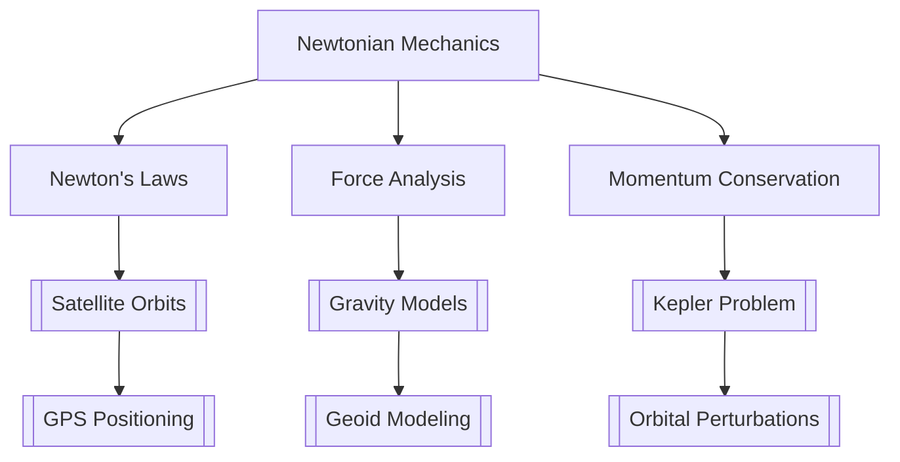

# Newtonian Mechanics

> Newton's laws, forces, inertial frames, momentum conservation

> **Part of:** [[Physics MOC]] · [[Physics_Curriculum_Guide]] · [[Study Plan]]

---

## 📚 Core Concept

> **Core idea in one sentence:** Newton's laws describe the relationship between forces acting on a body and the motion of that body.

> **Geodesy Connection:** How Newtonian mechanics applies to satellite orbital mechanics, gravity field modeling, and GPS positioning.

---

## 🧮 Key Equations

### Fundamental Equations

\begin{equation}
\\mathbf{F} = m\\mathbf{a}
\\end{equation}
\\text{(Newton's Second Law)}

\begin{equation}
\\mathbf{F}_{12} = -\mathbf{F}_{21}
\\end{equation}
\\text{(Newton's Third Law)}

\begin{equation}
\\mathbf{p} = m\\mathbf{v}
\\end{equation}
\\text{(Linear momentum)}

\begin{equation}
\\frac{d\\mathbf{p}}{dt} = \mathbf{F}_{\text{ext}}
\\end{equation}
\\text{(Momentum principle)}

### Derived Relations

\begin{equation}
\\mathbf{J} = \int \mathbf{F} \, dt = \Delta\\mathbf{p}
\\end{equation}
\\text{(Impulse-momentum theorem)}

\begin{equation}
\\mathbf{L} = \mathbf{r} \times \mathbf{p}
\\end{equation}
\\text{(Angular momentum)}

\begin{equation}
\\frac{d\\mathbf{L}}{dt} = \boldsymbol{\\tau}
\\end{equation}
\\text{(Torque-angular momentum theorem)}

---

## 📐 Derivations

### Derivation 1: Free Fall Motion

**Starting point:** Newton's second law with gravitational force

$$

\begin{equation}
\mathbf{F} = m\mathbf{g}
\end{equation}
\Rightarrow m\frac{d^2\mathbf{r}}{dt^2} = m\mathbf{g}
\Rightarrow \frac{d^2\mathbf{r}}{dt^2} = \mathbf{g}

$ $

**Result:** $ \mathbf{r}(t) = \frac{1}{2}\mathbf{g}t^2 + \mathbf{v}_0t + \mathbf{r}_0 $

---

## 🧭 Physical Intuition & Mental Models

> **Visual analogy:** A book on a table stays at rest until someone pushes it—forces balance until the push overcomes static friction.

> **Key insight:** Forces are interactions; motion changes only when there's an unbalanced external force.

> **Geodesy intuition:** Satellite orbits are constantly falling toward Earth but moving forward fast enough to miss it—perfect balance of inertial motion and gravitational force.

---

## 📊 Comparison Table

| Aspect | Classical | Relativistic | Quantum | Geodesy Application |
|--------|-----------|--------------|---------|---------------------|
| Framework | Newtonian mechanics | Special relativity | Quantum mechanics | Satellite orbit prediction |
| Key Equation | $\\mathbf{F} = m\\mathbf{a} $ | $\\mathbf{F} = \\frac{d\\mathbf{p}}{dt} $ | $\\hat{H}\\psi = i\\hbar\\frac{\\partial\\psi}{\\partial t} $ | Kepler's laws + perturbations |
| Domain | Macroscopic, low speed | High speeds, strong gravity | Atomic/subatomic scales | Orbital mechanics, positioning |

---

## 🧪 Example Problems

### Problem 1: Satellite Launch Velocity

**Given:** Earth's mass $ M_{\\oplus} = 5.972 \\times 10^{24} $ kg, Earth's radius $ R_{\\oplus} = 6.371 \\times 10^6 $  m

**Find:** Minimum orbital velocity at Earth's surface

**Solution:**

1. **Identify principle:** Centripetal force equals gravitational force
2. **Set up equations:** $\\frac{mv^2}{R_{\\oplus}} = \\frac{GM_{\\oplus}m}{R_{\\oplus}^2} $ 3. **Solve:** $  v = \\sqrt{\\frac{GM_{\\oplus}}{R_{\\oplus}}} = \\sqrt{\\frac{3.986\\times10^{14}}{6.371\\times10^6}} = 7,905 $ m/s
4. **Check:** Altitude required for stable orbit

**Answer:** $ v_\\text{orbital} = 7,905 $ m/s

---

## 🗺️ Concept Map

---

## 📚 References

| Source | Chapter/Section | Notes |
|--------|----------------|-------|
| Halliday & Resnick | Ch. 4-5 | Standard mechanics treatment |
| Griffiths | Ch. 3-4 | Intermediate treatment |
| Jackson | Ch. 1-2 | Advanced treatment |
| Heiskanen & Moritz | Ch. 2-3 | Geodesy application |

---

## 🔗 Links

- **Curriculum:** [[Physics_Curriculum_Guide]] · [[Study Plan]]
- **Semesters:** [[Semester_1]] · [[Semester_2]] · [[Semester_3]] · [[Semester_4]] · [[Semester_5]] · [[Semester_6]] · [[Semester_7]] · [[Semester_8]]
- **Related Concepts:** [[Lagrangian_Mechanics]] · [[Hamiltonian_Mechanics]] · [[Rotational_Dynamics]]
- **Resources:** [[Resources]] · [[Sources/Physics_Sources]]
- **Study Packs:** [[_Study Packs/]]

---

*Created by AIGIS Physics Specialist · Part of the AIGIS Knowledge Machine*
*Last updated: 2026-07-27*