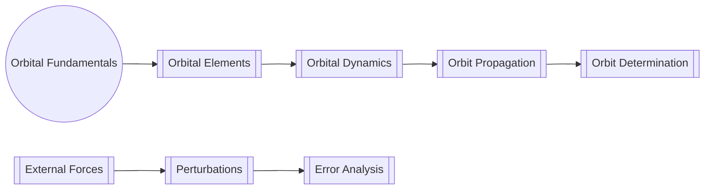

# Orbital Mechanics

**Orbital mechanics** (or astrodynamics) is the study of the motion of objects around other bodies under the influence of gravitational forces. It forms the foundation of space mission design, satellite orbit determination, and celestial navigation.

---

## ⚛️ Primary Content

### Topic | File | Description |
|---------|------|-------------|
| **Orbital Elements** | [[Orbital Elements]] | Six Keplerian parameters defining an orbit |
| **Kepler's Laws** | [[Keplers Laws]] | Fundamental laws of planetary motion |
| **Coordinate Transformations** | [[Orbital Coordinate Systems]] | Inertial ↔ Orbital frame conversions |
| **Orbit Propagators** | [[Propagating Orbits]] | Numerical integration of orbital motion |
| **Orbit Determination** | [[Orbit Determination]] | From observations to orbital parameters |

### For Geodesy Applications

| Geodesy Application | Key Concepts | Mathematical Tools |
|---------------------|--------------|-------------------|
| Satellite Positioning | Orbital ephemerides | Least squares adjustment |
| GNSS Corrections | Clock corrections, relativity | Special relativity formulas |
| Orbit Modeling | Perturbations, forces | Numerical integration |

---

## 🔄 Theory Progression

---

## 📐 Mathematical Formulation

### Two-Body Problem

The fundamental equation for orbital mechanics:

$$
\frac{d^2\mathbf{r}}{dt^2} = -\frac{\mu}{r^3}\mathbf{r}
$$

where:
- $$\mathbf{r}$$ = position vector
- $$\mu$$ = standard gravitational parameter
- $$r$$ = magnitude of r

### Orbital Elements

| Element | Symbol | Range | Physical Meaning |
|---------|--------|-------|------------------|
| Semi-major axis | $$a$$ | >0 | Orbit size |
| Eccentricity | $$e$$ | [0,1) | Orbit shape |
| Inclination | $$i$$ | [0°,180°] | Tilt relative to reference plane |
| Right ascension | $$\Omega$$ | [0°,360°] | Orientation of ascending node |
| Argument of periapsis | $$\omega$$ | [0°,360°] | Orientation within orbital plane |
| True anomaly | $$\nu$$ | [0°,360°] | Position along orbit |
