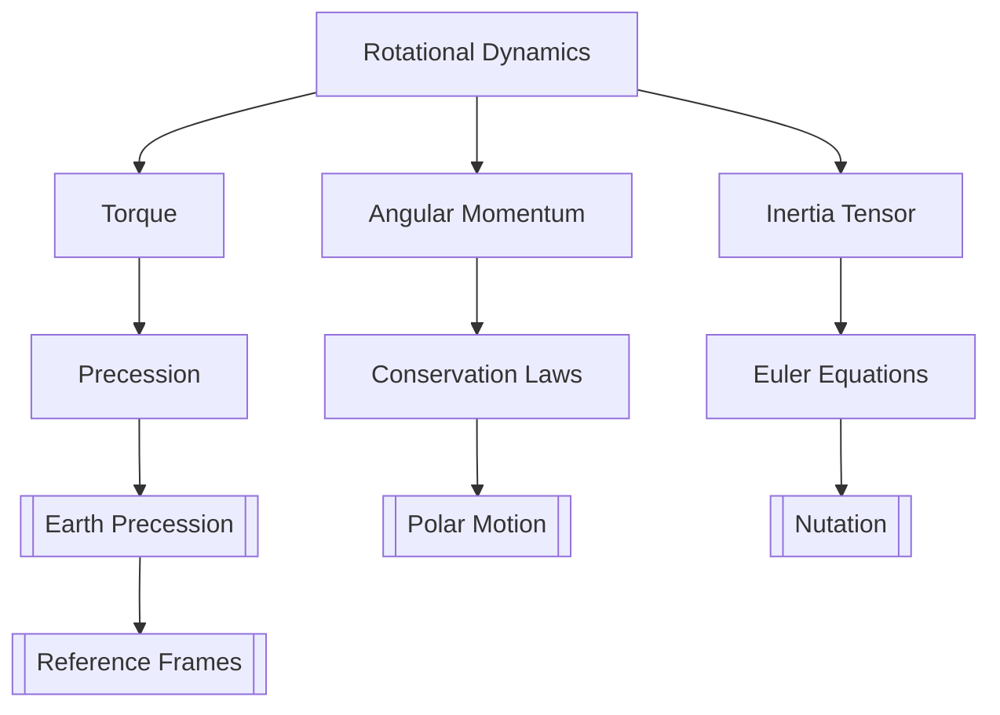

# Rotational Dynamics

> Angular momentum, torque, moment of inertia, rigid body rotation, Euler equations

> **Part of:** [[Physics MOC]] · [[Physics_Curriculum_Guide]] · [[Study Plan]]

---

## 📚 Core Concept

> **Core idea in one sentence:** Rotational dynamics describes how torques change angular momentum, governing spinning objects and Earth rotation.

> **Geodesy Connection:** Earth's rotation, polar motion, nutation, and precession — all rotational mechanics applied to a deformable Earth.

---

## 🧮 Key Equations

$$

\begin{equation}
\boldsymbol{\tau} = \mathbf{r} \times \mathbf{F}
\end{equation}
\text{(Torque definition)}

$ $

$$

\begin{equation}
\boldsymbol{\tau} = I\boldsymbol{\alpha}
\end{equation}
\text{(Rotational Newton's 2nd law)}

$ $

$$

\begin{equation}
L = I\omega
\end{equation}
\text{(Angular momentum for fixed axis)}

$ $

$$

\begin{equation}
T_{\text{rot}} = \frac{1}{2}I\omega^2
\end{equation}
\text{(Rotational kinetic energy)}

**### Euler's Equations for Rigid Body Rotation **

\begin{equation}
I_1\dot{\omega}_1 - (I_2 - I_3)\omega_2\omega_3 = \tau_1
\end{equation}

$ $

$$

\begin{equation}
I_2\dot{\omega}_2 - (I_3 - I_1)\omega_3\omega_1 = \tau_2
\end{equation}

$ $

$$

\begin{equation}
I_3\dot{\omega}_3 - (I_1 - I_2)\omega_1\omega_2 = \tau_3
\end{equation}
\text{(Euler's equations for torque-free rotation)}

$ $

### Moment of Inertia Table

| Shape | Axis | Moment of Inertia |
|-------|------|-------------------|
| Point mass | perpendicular | $ I = mr^2 $ |
| Solid sphere | through center | $ I = \frac{2}{5}MR^2 $ |
| Thin rod | through center | $ I = \frac{1}{12}ML^2 $ |
| Hollow cylinder | through center | $ I = \frac{1}{2}M(R_1^2 + R_2^2) $ |
| Oblate spheroid (Earth) | polar | $ I_{33} = \frac{8\pi}{15}\rho a^5(1-f) $ |

---

## 🧭 Physical Intuition & Mental Models

> **Visual analogy:** A figure skater pulling arms in spins faster — angular momentum conservation.

> **Key insight:** Earth is an oblate spheroid ( $ f \approx 1/298.257 $), so $ I_{33} \neq I_{11} = I_{22} $, causing precession under external torques.

> **Geodesy intuition:** Precession, nutation, and polar motion are all Euler equations applied to the real Earth under lunar/solar gravitational torques.

---

## 🧪 Example Problems

### Problem 1: Precession of Earth's Axis

**Given:** Earth's oblateness $ f = 1/298.257 $, lunisolar torque $ \tau $**Find:** Precession rate $ \psi $

**Solution:**

1. **Identify principle:** Euler equation for forced precession of oblate body
2. **Set up:** $ \tau = (I_3 - I_1)\Omega\psi $ 3. **Solve:**$ \psi = \frac{\tau}{(I_3 - I_1)\Omega} \approx 50.3''$/yr

**Answer:** Precession rate ≈ 50.3 arcsec/year

---

## 🗺️ Concept Map

---

## 🔗 Links

- **Related:** [[Newtonian_Mechanics]] · [[Lagrangian_Mechanics]]
- **Geodesy:** [[Gravitational_Potential_Theory]] · [[Orbital_Mechanics]]
- **Study Pack:** [[_Study Packs/]]

*Last updated: 2026-07-27*