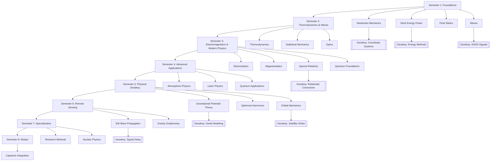
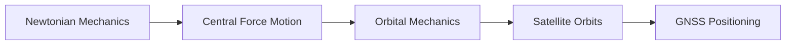
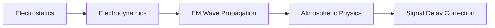
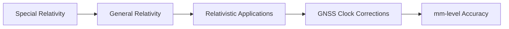
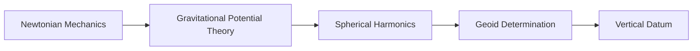

# 📚 Physics Curriculum — Master Roadmap

> **The definitive roadmap** linking all 8 semesters, 24 concepts, and geodesy applications.
> **Part of:** [[Physics MOC]] · [[Study Plan]]

---

## 🗺️ Full Curriculum Overview

---

## 📊 Semester-by-Semester Breakdown

### Semester 1 — Foundations of Classical Physics
**Focus:** Mechanics, waves, thermodynamics fundamentals
**Credits:** 14 SKS
**Key Courses:** Fisika Dasar I (Mekanika), Kalkulus I, Pengantar Geodesi

| Topic | Concept Note | Study Pack | Geodesy Link |
|-------|-------------|------------|--------------|
| Kinematics & Dynamics | [[Newtonian_Mechanics]] | [[Semester_1_Study_Pack]] | Coordinate systems, surveying |
| Work & Energy | [[Newtonian_Mechanics]] | [[Semester_1_Study_Pack]] | Potential theory |
| Conservation Laws | [[Newtonian_Mechanics]] | [[Semester_1_Study_Pack]] | Energy methods |
| Gravitation | [[Central_Force_Motion]] | [[Semester_1_Study_Pack]] | Gravity field |
| Fluid Statics | [[Fluid_Mechanics]] | [[Semester_1_Study_Pack]] | Hydrographic surveying |
| Waves | [[EM_Wave_Propagation]] | [[Semester_1_Study_Pack]] | Wave propagation |

---

### Semester 2 — Thermodynamics & Waves
**Focus:** Heat, entropy, wave physics, optics
**Credits:** 15 SKS
**Key Courses:** Fisika Dasar II (Termodinamika), Fisika Dasar III (Gelombang & Optika)

| Topic | Concept Note | Study Pack | Geodesy Link |
|-------|-------------|------------|--------------|
| Thermodynamic Laws | [[Thermodynamics]] | [[Semester_2_Study_Pack]] | Atmospheric modeling |
| Entropy & Engines | [[Thermodynamics]] | [[Semester_2_Study_Pack]] | Heat engines |
| Statistical Mechanics | [[Statistical_Mechanics]] | [[Semester_2_Study_Pack]] | Statistical physics |
| Mechanical Waves | [[EM_Wave_Propagation]] | [[Semester_2_Study_Pack]] | Wave propagation |
| Geometric Optics | [[Optics]] | [[Semester_2_Study_Pack]] | Surveying instruments |
| Wave Optics | [[Optics]] | [[Semester_2_Study_Pack]] | Interference, diffraction |

---

### Semester 3 — Electromagnetism & Modern Physics
**Focus:** EM theory, relativity, quantum foundations
**Credits:** 16 SKS
**Key Courses:** Fisika Klasik Lanjutan, Elektromagnetika, Fisika Modern

| Topic | Concept Note | Study Pack | Geodesy Link |
|-------|-------------|------------|--------------|
| Analytic Mechanics | [[Lagrangian_Mechanics]] | [[Semester_3_Study_Pack]] | Perturbation theory |
| Maxwell's Equations | [[Electrodynamics]] | [[Semester_3_Study_Pack]] | EM theory |
| EM Waves | [[EM_Wave_Propagation]] | [[Semester_3_Study_Pack]] | GNSS signals |
| Special Relativity | [[Special_Relativity]] | [[Semester_3_Study_Pack]] | Clock corrections |
| Quantum Foundations | [[Quantum_Foundations]] | [[Semester_3_Study_Pack]] | Quantum sensors |
| Atomic Physics | [[Quantum_Systems]] | [[Semester_3_Study_Pack]] | Atomic clocks |

---

### Semester 4 — Advanced Physics & Applications
**Focus:** Atmospheric physics, lasers, advanced quantum
**Credits:** 13 SKS
**Key Courses:** Fisika Atmosfer, Optika dan Photonik, Mekanika Kuantum Lanjutan

| Topic | Concept Note | Study Pack | Geodesy Link |
|-------|-------------|------------|--------------|
| Atmospheric Physics | [[Atmospheric_Physics]] | [[Semester_4_Study_Pack]] | Signal delay |
| Laser Physics | [[Optics]] | [[Semester_4_Study_Pack]] | LiDAR, interferometry |
| Quantum Applications | [[Quantum_Applications]] | [[Semester_4_Study_Pack]] | Quantum sensors |
| Statistical Physics | [[Statistical_Mechanics]] | [[Semester_4_Study_Pack]] | Phase transitions |
| Phase Transitions | [[Statistical_Mechanics]] | [[Semester_4_Study_Pack]] | Material properties |

---

### Semester 5 — Physical Geodesy & Field Measurement
**Focus:** Gravity field, potential theory, orbital mechanics
**Credits:** 12 SKS
**Key Courses:** Geodesi Fisik, Instrumen Geodesi, Mekanika Orbital

| Topic | Concept Note | Study Pack | Geodesy Link |
|-------|-------------|------------|--------------|
| Potential Theory | [[Gravitational_Potential_Theory]] | [[Semester_5_Study_Pack]] | Geoid modeling |
| Spherical Harmonics | [[Gravitational_Potential_Theory]] | [[Semester_5_Study_Pack]] | Gravity models |
| Geoid & Heights | [[Gravitational_Potential_Theory]] | [[Semester_5_Study_Pack]] | Vertical datums |
| Gravity Instruments | [[Gravitational_Potential_Theory]] | [[Semester_5_Study_Pack]] | Gravimetry |
| Orbital Mechanics | [[Orbital_Mechanics]] | [[Semester_5_Study_Pack]] | Satellite orbits |
| GNSS Positioning | [[EM_Wave_Propagation]] | [[Semester_5_Study_Pack]] | GPS positioning |

---

### Semester 6 — Remote Sensing & Advanced Instrumentation
**Focus:** EM remote sensing, gravity gradiometry, spatial databases
**Credits:** 13 SKS
**Key Courses:** Remote Sensing, Penginderaan Jauh Lanjutan, Pemetaan Gravitasi

| Topic | Concept Note | Study Pack | Geodesy Link |
|-------|-------------|------------|--------------|
| EM Interaction | [[EM_Wave_Propagation]] | [[Semester_6_Study_Pack]] | Remote sensing |
| Spectral Analysis | [[Nuclear_Particle_Physics]] | [[Semester_6_Study_Pack]] | Spectral signatures |
| Gravity Gradiometry | [[Gravitational_Potential_Theory]] | [[Semester_6_Study_Pack]] | GOCE mission |
| Spatial Databases | [[Nuclear_Particle_Physics]] | [[Semester_6_Study_Pack]] | GIS integration |
| Control Systems | [[Nuclear_Particle_Physics]] | [[Semester_6_Study_Pack]] | Instrument control |

---

### Semester 7 — Specialization & Research Methods
**Focus:** Research methodology, advanced instrumentation, professional practice
**Credits:** 12 SKS
**Key Courses:** Kriptografi, Metode Khusus Jarak, Pemodelan & Simulasi

| Topic | Concept Note | Study Pack | Geodesy Link |
|-------|-------------|------------|--------------|
| Research Methods | [[Nuclear_Particle_Physics]] | [[Semester_7_Study_Pack]] | Thesis methodology |
| EDM & Lidar | [[EM_Wave_Propagation]] | [[Semester_7_Study_Pack]] | Distance measurement |
| Monte Carlo | [[Statistical_Mechanics]] | [[Semester_7_Study_Pack]] | Stochastic modeling |
| Stochastic Processes | [[Statistical_Mechanics]] | [[Semester_7_Study_Pack]] | Error analysis |
| Professional Ethics | [[Nuclear_Particle_Physics]] | [[Semester_7_Study_Pack]] | Professional practice |

---

### Semester 8 — Capstone Project (Skripsi)
**Focus:** Integration of all physics concepts into a research project
**Credits:** 4 SKS
**Key Courses:** Skripsi

| Topic | Concept Note | Study Pack | Geodesy Link |
|-------|-------------|------------|--------------|
| Capstone Integration | [[Physics MOC]] | [[Semester_8_Study_Pack]] | Full synthesis |
| Academic Writing | [[Physics MOC]] | [[Semester_8_Study_Pack]] | Thesis writing |
| Thesis Defense | [[Physics MOC]] | [[Semester_8_Study_Pack]] | Presentation |

---

## 🧭 Learning Pathways

### Pathway 1: Classical Mechanics → Geodesy

### Pathway 2: Electromagnetism → GNSS Physics

### Pathway 3: Relativity → Precision Positioning

### Pathway 4: Potential Theory → Geoid Modeling

---

## 📋 Prerequisites Matrix

| Concept | Requires | Enables |
|---------|----------|---------|
| Newtonian Mechanics | Basic calculus, vectors | Lagrangian Mechanics, Orbital Mechanics |
| Electrostatics | Vector calculus | Electrodynamics, EM Waves |
| Thermodynamics | Basic calculus | Statistical Mechanics, Atmospheric Physics |
| Special Relativity | Algebra, vectors | General Relativity, GNSS Corrections |
| Quantum Foundations | Linear algebra | Quantum Systems, Quantum Applications |
| Gravitational Potential Theory | Vector calculus, Newtonian Mechanics | Geoid Modeling, Spherical Harmonics |
| EM Wave Propagation | Electrodynamics | Atmospheric Physics, GNSS |
| Orbital Mechanics | Newtonian Mechanics, Central Force | Satellite Positioning |

---

## 🔗 Navigation

- **MOC:** [[Physics MOC]]
- **Study Plan:** [[Study Plan]]
- **Resources:** [[Resources]]
- **Sources:** [[Sources/Physics_Sources]]
- **Semester Packs:** [[Semester_1/Semester_1_Study_Pack]] · [[Semester_2/Semester_2_Study_Pack]] · [[Semester_3/Semester_3_Study_Pack]] · [[Semester_4/Semester_4_Study_Pack]] · [[Semester_5/Semester_5_Study_Pack]] · [[Semester_6/Semester_6_Study_Pack]] · [[Semester_7/Semester_7_Study_Pack]] · [[Semester_8/Semester_8_Study_Pack]]

---

*Created by AIGIS Physics Specialist · Part of the AIGIS Knowledge Machine*
*Last updated: 2026-07-27*