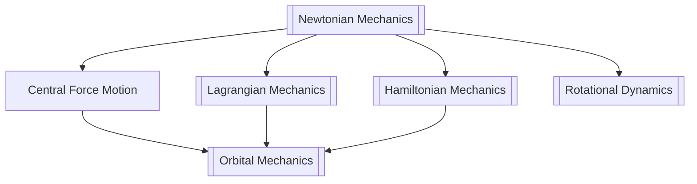
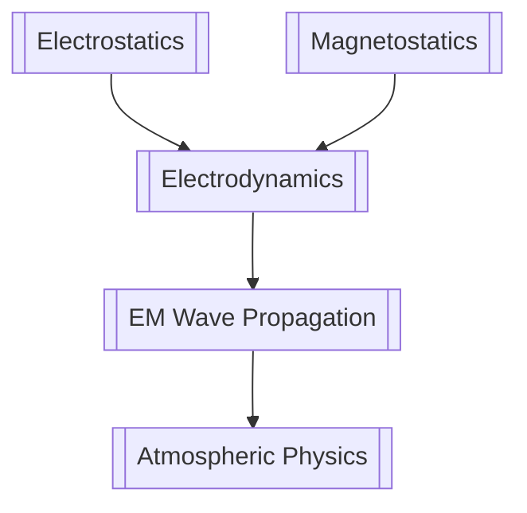
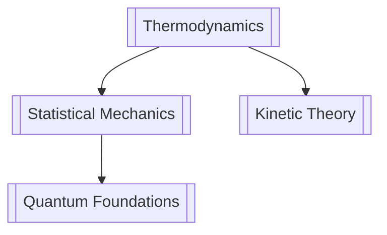
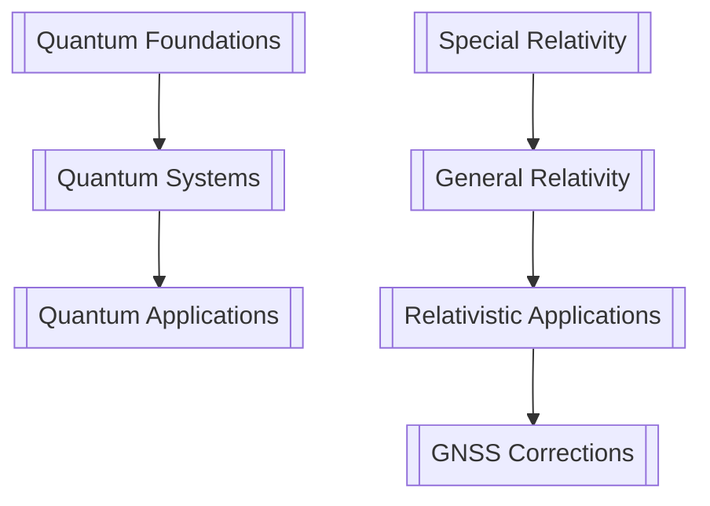
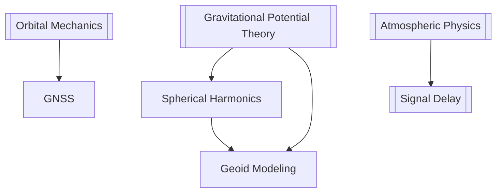

# 🔭 PHYSICS — Knowledge Learning Genius

> *"Physicists work in problems until they can be stated in the language of mathematics, then solve them."*

Your **living Physics knowledge base**, built by AIGIS from your source documents and kept in sync to NotebookLM via Google Drive. Physics explains WHY the math works in the real world — forces, fields, waves, gravity, time, space — all of which shape how we measure Earth.

---

## 🔗 Part of the bigger picture

Three subjects — start from the top:
➡️ [[AIGIS Hub]] · [[Mathematics MOC]] · [[Geodesy MOC]]

Physics connects to [[Mathematics MOC]] (vector calculus, differential equations) and [[Geodesy MOC]] (gravity field, GNSS signals, reference frames).

---

## 🧭 How to study with me

1. Start with the **Curriculum Guide** → [[Physics_Curriculum_Guide]] to see the full roadmap.
2. Follow the **Study Plan** → [[Study Plan]] for weekly structure.
3. Pick a **Concept Cluster** below to dive into theory.
4. Ask AIGIS on Telegram: *"explain Maxwell's equations intuitively"*, *"study pack on rotational dynamics"*, *"explain the geoid like a genius tutor"*.
5. Drop NotebookLM answers / your notes in `_Inbox/` → AIGIS files them into the right note.

---

## 📚 Open-Access Resources (always fresh)

Curated bibliography of open-access textbooks, MIT OCW, NASA/USGS resources, and key papers — all legal, all free.
➡️ **[[Sources/Physics_Sources]]** — annotated bibliography with chapter mappings.

## 📅 Curriculum & Study Plan

➡️ [[Physics_Curriculum_Guide]] — Semester-by-semester alignment with UGM Geodesy
➡️ [[Study Plan]] — Weekly rhythm, milestones, progress tracking
➡️ [[Curriculum/Curriculum]] — Master roadmap linking all semesters and concepts

---

## 🗺️ Knowledge-Machine Progression (Fundamentals → Advanced)

1. **Foundations:** [[Newtonian_Mechanics]] → [[Lagrangian_Mechanics]] → [[Hamiltonian_Mechanics]] → [[Rotational_Dynamics]] → [[Central_Force_Motion]]
2. **Thermodynamics & Statistics:** [[Thermodynamics]] → [[Statistical_Mechanics]] → [[Kinetic_Theory]]
3. **Electromagnetism:** [[Electrostatics]] → [[Magnetostatics]] → [[Electrodynamics]] → [[EM_Wave_Propagation]]
4. **Quantum Physics:** [[Quantum_Foundations]] → [[Quantum_Systems]] → [[Quantum_Applications]]
5. **Relativity:** [[Special_Relativity]] → [[General_Relativity]] → [[Relativistic_Applications]]
6. **Advanced Topics:** [[Fluid_Mechanics]] · [[Optics]] · [[Nuclear_Particle_Physics]]
7. **Geodesy Physics:** [[Gravitational_Potential_Theory]] · [[Atmospheric_Physics]] · [[Orbital_Mechanics]]

---

## 🗺️ Concept Hub — Graph View Navigation

### Classical Mechanics Cluster

### Electromagnetism Cluster

### Thermodynamics & Stats Cluster

### Quantum & Relativity Cluster

### Geodesy Physics Cluster

---

## 📊 Concept Cluster Quick Access

| Cluster | Concept Files | Geodesy Links |
|---------|--------------|---------------|
| Classical Mechanics | [[Newtonian_Mechanics]] · [[Lagrangian_Mechanics]] · [[Hamiltonian_Mechanics]] · [[Rotational_Dynamics]] · [[Central_Force_Motion]] | Orbital mechanics, satellite dynamics |
| Electromagnetism | [[Electrostatics]] · [[Magnetostatics]] · [[Electrodynamics]] · [[EM_Wave_Propagation]] | GNSS signal propagation |
| Thermodynamics & Stats | [[Thermodynamics]] · [[Statistical_Mechanics]] · [[Kinetic_Theory]] | Atmospheric modeling, tides |
| Quantum Physics | [[Quantum_Foundations]] · [[Quantum_Systems]] · [[Quantum_Applications]] | Quantum sensors, atomic clocks |
| Relativity | [[Special_Relativity]] · [[General_Relativity]] · [[Relativistic_Applications]] | GNSS clock corrections |
| Advanced Topics | [[Fluid_Mechanics]] · [[Optics]] · [[Nuclear_Particle_Physics]] | Hydrographic surveying, remote sensing |
| Geodesy Physics | [[Gravitational_Potential_Theory]] · [[Atmospheric_Physics]] · [[Orbital_Mechanics]] | Height systems, geoid modeling |

---

## 📚 Open-Access Resources (always fresh)

Curated bibliography of open-access textbooks, MIT OCW, NASA/USGS resources, and key papers — all legal, all free.
➡️ **[[Sources/Physics_Sources]]** — tables updated daily with new finds.

---

## 🎓 Physics Study Packs (AIGIS)

Each pack covers a physics area with syllabus, key formulas, example problems, and concept maps:

### Semester Study Packs

| Semester | Focus | Pack File |
|----------|-------|-----------|
| Semester 1 | Foundations of Classical Physics | [[Semester_1/Semester_1_Study_Pack]] |
| Semester 2 | Thermodynamics & Waves | [[Semester_2/Semester_2_Study_Pack]] |
| Semester 3 | Electromagnetism & Modern Physics | [[Semester_3/Semester_3_Study_Pack]] |
| Semester 4 | Advanced Physics & Applications | [[Semester_4/Semester_4_Study_Pack]] |
| Semester 5 | Physical Geodesy & Field Measurement | [[Semester_5/Semester_5_Study_Pack]] |
| Semester 6 | Remote Sensing & Advanced Instrumentation | [[Semester_6/Semester_6_Study_Pack]] |
| Semester 7 | Skripsi & Specialization | [[Semester_7/Semester_7_Study_Pack]] |
| Semester 8 | Capstone Project | [[Semester_8/Semester_8_Study_Pack]] |

---

## 📚 Curriculum (semester-aligned with UGM Geodesy)

- **Curriculum Master:** [[Curriculum/Curriculum]] — full roadmap of all 8 semesters, 24 concepts
- **Semester 1:** [[Semester_1/Semester_1_Study_Pack]] — Fisika Dasar (mechanics, waves, thermo, fluids)
- **Semester 2:** [[Semester_2/Semester_2_Study_Pack]] — Dasar-dasar Geofisika dan Astronomi
- **Semester 3:** [[Semester_3/Semester_3_Study_Pack]] — Elektromagnetika & Fisika Modern
- **Semester 4:** [[Semester_4/Semester_4_Study_Pack]] — Fisika Atmosfer & Photonik
- **Semester 5:** [[Semester_5/Semester_5_Study_Pack]] — Geodesi Fisis (potential theory, height systems)
- **Semester 6:** [[Semester_6/Semester_6_Study_Pack]] — Remote Sensing & Gravimetry
- **Semester 7:** [[Semester_7/Semester_7_Study_Pack]] — Skripsi & Spesialisasi
- **Semester 8:** [[Semester_8/Semester_8_Study_Pack]] — Capstone Integration

---

## 🔗 How it connects

- Underpins [[Geodesy MOC]] (gravity field, physical geodesy, GNSS signals)
- Feeds your NotebookLM *Physics* source notebook via Google Drive
- All 24 concept files link through [[wikilinks]] for cross-navigation

## ▶️ Use it

Ask AIGIS: *"explain gravitational potential like a tutor"*, *"study pack on wave physics for GNSS"*, *"explain relativistic clock correction"*, *"what's the physics behind the geoid?"*.

---

## 🗺️ Graph View Quick Tips

1. Open **Graph View** in Obsidian
2. Search for `tag:#physics` to see all concept relationships
3. Click on any concept node to see linked notes
4. Use `[[wikilinks]]` to navigate between physics and geodesy notes
5. The graph auto-refreshes as you create new links

---

➡️ [[AIGIS Hub]] · [[Mathematics MOC]] · [[Geodesy MOC]]

---

*Maintained by AIGIS Physics Specialist · Interlinked with Obsidian wikilinks — open Graph View.*
*Last updated: 2026-07-27*