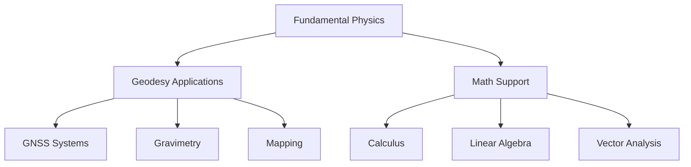

# ⚛️ Physics — Knowledge Map of Content (MOC)

> *"The mathematical foundation of physical Earth systems — bridging theoretical physics with geodetic applications."*

---

## 🎯 Vision

**Physics** provides the fundamental principles that explain geodetic measurements, from satellite positioning to gravitational variations. This MOC maps the complete physics curriculum tailored specifically for Earth sciences and geodesy applications.

---

## 🗺️ Mindmap

```mermaid
mindmap
  root((Physics Knowledge Base))
    Classical Mechanics
      [[Newtonian Mechanics]]
      [[Lagrangian Mechanics]]
      [[Hamiltonian Mechanics]]
      [[Central Force Motion]]
      [[Rotational Dynamics]]
      [[Kinematics and Dynamics]]
    Electromagnetism
      [[Electrostatics]]
      [[Magnetostatics]]
      [[Electrodynamics]]
      [[EM Wave Propagation]]
    Thermodynamics & Fluids
      [[Thermodynamics]]
      [[Kinetic Theory]]
      [[Fluid Mechanics]]
    Modern Physics
      [[Quantum Foundations]]
      [[Quantum Systems]]
      [[Special Relativity]]
      [[Physics/Concepts/Relativistic Clock Correction]]
    Applied Physics
      [[EM Wave Propagation]]
      [[Electromagnetism & Signal Propagation]]
      [[Optics & Atmospheric Refraction]]
      [[Ionospheric Delay]]
      [[Relativistic Clock Correction]]
      [[Signal Processing]]
    Geophysics
      [[Gravitational Potential]]
      [[Atmospheric Physics]]
      [[Physics/Concepts/Orbital_Mechanics]]
    Waves & Optics
      [[Waves & Oscillations]]
      [[Optics & Atmospheric Refraction]]
```

---

## 🔗 Prerequisites & Integration

### Physics-Geodesy Integration



---

## 📚 Key Content

### 1. Fundamental Physics

| Topic | File | Geodesy Application |
|-------|------|---------------------|
| Mechanics | [[Classical Mechanics]] | Reference frames, motion |
| Electromagnetism | [[Electromagnetism]] | GNSS signal theory |
| Thermodynamics | [[Thermodynamics]] | Atmospheric models |
| Optics | [[Optics & Atmospheric Refraction]] | Atmospheric corrections |

### 2. Applied Physics for Geodesy

| Application | File | Math Tools |
|-------------|------|------------|
| GNSS Signal | [[Electromagnetism & Signal Propagation]] | [[Mathematics/Concepts/Linear Algebra]] |
| Atmospheric | [[Ionospheric Delay]] | [[Mathematics/Concepts/Complex Analysis]] |
| Gravity | [[Gravitational Potential]] | [[Mathematics/Concepts/Multivariable Calculus]] |

---

## 🎓 Study Roadmap

- **Week 1-3 (Core)**: Mechanics, Electromagnetism, Thermodynamics
- **Week 4-8 (Modern/Applied)**: Quantum, Fluid Mechanics, Statistics
- **Semester 9+ (Advanced)**: Relativity, Geodesy-specific applications

---

## 🔗 Related Concepts
- [[Mathematics/Mathematics MOC]]
- [[Geodesy/Geodesy MOC]]
- [[AIGIS Hub]]

---

*Last updated: 2026-07-27 | [[AIGIS Hub]]*
