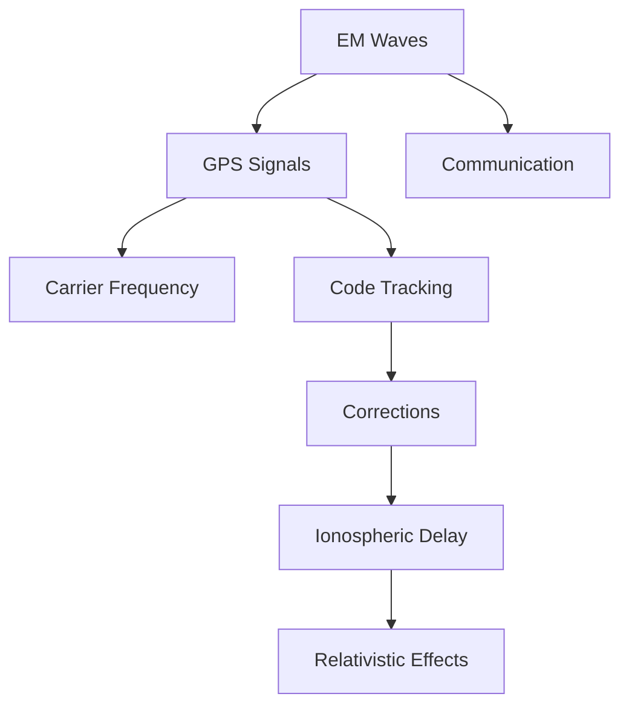

# ⚛️ Physics — Knowledge Map of Content (MOC)

> *"The mathematical foundation of physical Earth systems — bridging theoretical physics with geodetic applications."*

---

## 🎯 Vision

**Physics** provides the fundamental principles that explain geodetic measurements, from satellite positioning to gravitational variations. This MOC maps the complete physics curriculum tailored specifically for Earth sciences and geodesy applications.

---

## 📊 Subject Overview

### Core Domains

```mermaid
mindmap
 root((Physics Knowledge Base))
 Foundation
 ⚡ [[Physics MOC|MOC Hub]]
 🏷️ [[Physics/Physics_Curriculum_Guide|Curriculum Guide]]
 📚 [[Physics/Resources.md|Resources]]
 📅 [[Physics/Study Plan.md|Study Plans]]

 Mechanics
 🌊 [[Physics/Concepts/Classical Mechanics]]
 ⚡ [[Physics/Concepts/Electromagnetism]]
 🌡️ [[Physics/Concepts/Thermodynamics]]

 Modern Physics
 🌿 [[Physics/Concepts/Quantum Mechanics]]
 🌙 [[Physics/Concepts/Relativity]]
 🎯 [[Physics/Concepts/Statistical Mechanics]]

 Applied Physics
 📡 [[Physics/Concepts/Electromagnetism & Signal Propagation]]
 🌊 [[Physics/Concepts/Fluid Mechanics]]
 👁️ [[Physics/ Concepts/Optics & Atmospheric Refraction]]
 💫 [[Physics/Concepts/Ionospheric Delay]]

 Computational Physics
 🧮 [[Physics/Concepts/Numerical Methods]]
 📊 [[Physics/Concepts/Statistical Mechanics]]
 🔍 [[Physics/Concepts/Time Series Analysis]]

 Curricula
 📚 [[Physics/Curriculum]]
 🎓 [[Physics/Curriculum/Semester_1|Semester 1]]
 🎓 [[Physics/Curriculum/Semester_2|Semester 2]]
 🎓 [[Physics/Curriculum/Semester_3|Semester 3]]
 🎓 [[Physics/Curriculum/Semester_4|Semester 4]]
 🎓 [[Physics/Curriculum/Semester_5|Semester 5]]
 🎓 [[Physics/Curriculum/Semester_6|Semester 6]]
 🎓 [[Physics/Curriculum/Semester_7|Semester 7]]
 🎓 [[Physics/Curriculum/Semester_8|Semester 8]]

 Research & Tools
 🔧 [[Physics/_Study Packs|Study Packs]]
 📝 [[Physics/_Inbox|Inbox]]
 🌐 [[Physics/Pilihan/README.md|Electives]]

---

## 🔗 Interlinked Structure

### Prerequisites

**Core → Applied → Specialized**

1. **Core**: Classical Mechanics → Electromagnetism
2. **Applied**: Thermodynamics → Fluid Mechanics
3. **Specialized**: Quantum → Relativity

### Physics-Geodesy Integration

```mermaid
graph TD
 A[Fundamental Physics] --> B[Geodesy Applications]
 B --> C[GNSS Systems]
 B --> D[Gravimetry]
 B --> E[Mapping]

 A --> F[Math Support]
 F --> G[Calculus]
 F --> H[Linear Algebra]
 F --> I[Vector Analysis]
```

---

## 📚 Key Content Categories

### 1. Fundamental Physics

| Topic | File | Geodesy Application |
|-------|------|---------------------|
| Mechanics | [[Physics/Concepts/Classical Mechanics]] | Reference frames, motion |
| Electromagnetism | [[Physics/Concepts/Electromagnetism]] | [[GNSS]] signal theory |
| Thermodynamics | [[Physics/Concepts/Thermodynamics]] | Atmospheric models |
| Optics | [[Physics/Concepts/Optics & Atmospheric Refraction]] | Atmospheric corrections |

### 2. Modern Physics

| Topic | File | Geodesy Application |
|-------|------|---------------------|
| Quantum Mechanics | [[Physics/Concepts/Quantum Mechanics]] | GPS clock corrections |
| Relativity | [[Physics/Concepts/Relativity]] | General relativity, time transfer |
| Statistical Mechanics | [[Physics/Concepts/Statistical Mechanics]] | Thermal noise, geodesy modeling |

### 3. Applied Physics for Geodesy

| Application | File | Mathematical Tools |
|-------------|------|-------------------|
| GNSS Signal Processing | [[Physics/Concepts/Electromagnetism & Signal Propagation]] | [[Mathematics/Concepts/Linear Algebra]] |
| Atmospheric Effects | [[Physics/Concepts/Ionospheric Delay]] | [[Mathematics/Concepts/Complex Numbers]] |
| Gravitational Effects | [[Physics/Concepts/Gravitational Potential]] | [[Mathematics/Concepts/Calculus]] |

---

## 🎓 Study Roadmap

### Foundation (Weeks 1-3)

- **Week 1**: Classical Mechanics ([[Physics/Concepts/Classical Mechanics]])
- **Week 2**: Electromagnetism ([[Physics/Concepts/Electromagnetism]])
- **Week 3**: Thermodynamics ([[Physics/Concepts/Thermodynamics]])

### Intermediate (Weeks 4-8)

- **Week 4-5**: Modern Physics ([[Physics/Concepts/Quantum Mechanics]])
- **Week 6-7**: Applied Physics ([[Physics/Concepts/Fluid Mechanics]])
- **Week 8**: Integration ([[Physics/Concepts/Statistical Mechanics]])

### Advanced (Semester 9+)

- **Geodesy-Specific**: [[Physics/Concepts/Relativistic Clock Correction]]
- **Research Methods**: [[Physics/_Study Packs/Study Packs]]

---

## 🔍 Navigation Tips

### Quick Access

- **Start Here**: [[Physics MOC]] (current page)
- **Core Courses**: [[Physics/Physics_Curriculum_Guide]]
- **Study Plans**: [[Physics/Study Plan.md]]
- **Resources**: [[Physics/Resources.md]]

### Learning Path

1. Begin with [[Physics MOC]] for overall structure
2. Use [[Physics/Physics_Curriculum_Guide]] for semester-by-semester progression
3. Focus on Geodesy-relevant topics: [[Physics/Concepts/Electromagnetism & Signal Propagation]], [[Physics/Concepts/Relativistic Clock Correction]]
4. Access [[Physics/_Study Packs]] for specialized applications

### Engineering Applications

```mermaid
graph LR
 A[Engineering]] --> B[GNSS Systems]
 A --> C[GNSS Systems]
 A --> D[Atmospheric Corrections]
 A --> E[Gravitational Models]
```

---

## 📚 Essential Physics Topics for Geodesy

### Critical Concepts

| Concept | File | Mathematical Foundation |
|---------|------|------------------------|
| EM Wave Propagation | [[Physics/Concepts/Electromagnetism & Signal Propagation]] | Complex numbers, wave equations |
| Ionospheric Delay | [[Physics/Concepts/Ionospheric Delay]] | Maxwell's equations, plasma physics |
| Relativistic Effects | [[Physics/Concepts/Relativistic Clock Correction]] | General relativity |
| Atmospheric Refraction | [[Physics/Concepts/Optics & Atmospheric Refraction]] | Snell's law, atmospheric optics |

### Numerical Methods

| Method | File | Application |
|--------|------|-------------|
| Numerical Analysis | [[Physics/Concepts/Numerical Methods]] | Solution of physics equations |
| Signal Processing | [[Physics/Concepts/Statistical Mechanics]] | Time series analysis |
| Error Analysis | [[Physics/Concepts/Statistical Mechanics]] | Uncertainty propagation |

---

## 🎯 Getting Started

### For Geodesy Students

1. **Focus Areas**: [[Physics/Concepts/Electromagnetism & Signal Propagation]] (GS signal behavior)
2. **Essential Reading**: [[Physics/Concepts/Relativistic Clock Correction]] (GPS corrections)
3. **Practice**: [[Physics/Concepts/Optics & Atmospheric Refraction]] (atmospheric modeling)

### For Physics Students

1. **Use**: [[Physics/Physics_Curriculum_Guide]] for structured progression
2. **Apply**: Concepts to [[Geodesy MOC]] for geodetic context
3. **Integrate**: [[Mathematics/Concepts]] for mathematical foundations

### For Engineers

1. **Quick Ref**: [[Physics/Physics_Curriculum_Guide]] for course content
2. **Applications**: [[Physics/Concepts/Electromagnetism & Signal Propagation]] for GNSS systems
3. **Implementation**: [[Physics/_Study Packs]] for practical case studies

---

## 🔧 Technical Content

### Mermaid Diagrams



### Equations

- **Wave Equation**: $ \nabla^2 \psi - \frac{1}{c^2}\frac{\partial^2\psi}{\partial t^2} = 0 $- **Sagnac Effect**: $ \Delta t = \frac{4\omega A}{c^2} $- **Iono Delay**: $ \Delta t_{iono} \propto \frac{f^2}{\cos^2 \text{ (elevation) }}$

---

## 📧 Updates & Notes

### Recent Changes
- [ ] Semester 8 physics curriculum updated with thesis guidance
- [ ] New concept files added for signal processing and relativity
- [ ] Enhanced cross-references to geodesy applications

### Inbox
- [[Physics/_Inbox/Physics_Inbox.md]]
- [[Physics/_Inbox/_processed]]

---

## 🔗 External Links

- **AIGIS Hub**: [[AIGIS Hub.md]]
- **Geodesy MOC**: [[Geodesy/Geodesy MOC.md]]
- **Mathematics MOC**: [[Mathematics/Mathematics MOC.md]]

---

## 📈 Next Development Steps

1. **Enhance**: Interactive physics simulators and visualizations
2. **Expand**: Research sections on modern physics applications
3. **Add**: Engineering case studies and practical examples
4. **Integrate**: Cross-disciplinary projects with geodesy

---

## 🔄 Version Control

**Last Updated**: 2026-07-27
**Status**: Active Development
**Version**: 1.0

---

*Page last updated: 2026-07-27 | AIGIS Content™*
📧 **Contact**: [[Physics/_Inbox/Physics_Inbox.md]] for feedback
🌐 **GitHub**: [[AIGIS Hub.md]] for repository navigation
⚛️ **Learning**: [[Physics/Physics_Curriculum_Guide]] for course structure