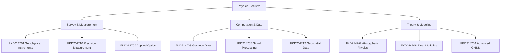

# 🎓 Physics Elective Courses (Pilihan)

> *"Specialized physics electives bridging fundamental physics with geodetic applications."*

---

## 1. Available Electives

| Code | Course | Semester | SKS | Focus |
|------|--------|----------|-----|-------|
| FKD214701 | Instrumentasi Geofisika | 7 | 3 | Geophysical instruments |
| FKD214702 | Fisika Atmosfer Lanjutan | 7 | 3 | Advanced atmospheric physics |
| FKD214703 | Analisis Data Geodetik | 7 | 3 | Geodetic data analysis |
| FKD214704 | Teknologi GNSS Lanjutan | 7 | 3 | Advanced GNSS technology |
| FKD214705 | Pemrosesan Sinyal Digital | 7 | 3 | Digital signal processing |
| FKD214706 | Sensor dan Aktuator | 7 | 3 | Sensors for geodesy |
| FKD214707 | Sistem Kontrol Lanjutan | 7 | 3 | Advanced control systems |
| FKD214708 | Pemodelan Fisika Bumi | 7 | 3 | Earth physics modeling |
| FKD214709 | Optika Geometri Terapan | 7 | 3 | Applied geometric optics |
| FKD214710 | Metode Pengukuran Presisi | 7 | 3 | Precision measurement methods |
| FKD214711 | Pemrograman Sistem Embedded | 7 | 3 | Embedded programming |
| FKD214712 | Manajemen Data Geospasial Lanjutan | 7 | 3 | Advanced geospatial data mgmt |
| FKD214713 | Interoperabilitas Sistem | 7 | 3 | System interoperability |
| FKD214714 | Standar dan Kalibrasi | 7 | 3 | Standards and calibration |

---

## 2. Elective Descriptions

### FKD214701 — Instrumentasi Geofisika

**Topics:** Gravimeters, magnetometers, seismometers, tiltmeters.
**Lab:** Instrument setup, calibration, field deployment.
**Geodesy link:** [[Gravity Field]], [[Crustal Deformation]]

### FKD214704 — Teknologi GNSS Lanjutan

**Topics:** Multi-constellation (GPS+GLONASS+Galileo+BeiDou), PPP, precise orbits.
**Lab:** Processing with Bernese/GAMIT.
**Geodesy link:** [[GNSS]], [[RTK]], [[PPP]]

### FKD214708 — Pemodelan Fisika Bumi

**Topics:** Earth's gravity field, elastic Earth models, tides, post-glacial rebound.
**Geodesy link:** [[Gravity Field]], [[Geoid Undulation]], [[Tidal Theory]]

---

## 3. Elective Selection Guide

---

## 4. Learning Outcomes

Students who complete 3+ electives will:
- Specialize in a geodetic application domain
- Develop practical instrumentation/computation skills
- Build expertise for thesis topic selection
- Prepare for professional or graduate studies

---

## 5. Cross-links

- Core: [[Physics MOC]], [[Physics_Curriculum_Guide]]
- Geodesy electives: [[Pilihan/README|Geodesy Pilihan]]
- Related concepts: [[Instrumentation]], [[Signal_Processing]], [[GNSS]]

*Page last updated: 2026-07-27 | AIGIS Content™*