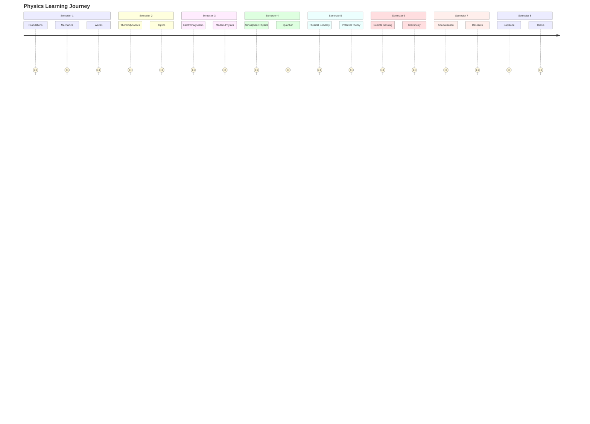

# 📅 Physics Study Plan — 8-Semester Roadmap

> **Purpose:** Structured learning path for physics as applied to geodesy
> **Duration:** 8 semesters (full UGM Geodesy program)
> **Part of:** [[Physics MOC]] · [[Physics_Curriculum_Guide]]

---

## 🗺️ 8-Semester Roadmap Overview

---

## 📊 Milestone Tracker

| Semester | Key Milestone | Target Date | Status |
|----------|--------------|-------------|--------|
| Sem 1 | Master Newtonian mechanics & waves | Week 16 | ☐ |
| Sem 2 | Thermodynamic laws & heat engines | Week 16 | ☐ |
| Sem 3 | Maxwell's equations & relativity | Week 16 | ☐ |
| Sem 4 | Atmospheric physics & quantum apps | Week 16 | ☐ |
| Sem 5 | Geoid modeling & spherical harmonics | Week 16 | ☐ |
| Sem 6 | Remote sensing physics | Week 16 | ☐ |
| Sem 7 | Research methodology complete | Week 16 | ☐ |
| Sem 8 | Skripsi defense complete | Week 16 | ☐ |

---

## 📅 Semester 1 — Classical Mechanics & Thermodynamics

### Primary Goals:
- [ ] Master Newtonian mechanics (vectors, kinematics, dynamics)
- [ ] Understand energy, work, and conservation laws
- [ ] Build foundation for wave/optics (later for remote sensing)
- [ ] Apply physics to geodetic observables

### Weekly Rhythm:
| Day | Focus | Duration |
|-----|-------|----------|
| Mon | New topic (kinematics/forces) | 2 hrs |
| Tue | Problem solving | 2 hrs |
| Wed | New topic (energy/waves) | 2 hrs |
| Thu | Problem solving | 2 hrs |
| Fri | Integration + geodetic context | 1.5 hrs |
| Sat | Deep practice + experiments | 3 hrs |
| Sun | Rest + conceptual review | 1 hr |

### Key Milestones (Sem 1):
- [ ] **Week 4:** Pass Newton's Laws quiz with vectors
- [ ] **Week 8:** Complete energy/momentum problem set
- [ ] **Week 12:** Pass waves/oscillations quiz
- [ ] **Week 16:** Final exam — physics for geodesy applications

### Geodesy Connections:
- Vectors → Coordinate transformations
- Forces → Satellite orbital mechanics
- Energy → Gravity potential theory
- Waves → EM wave propagation (GPS signals)
- Fluids → Hydrographic surveying

### Resources:
- OpenStax University Physics Vol 1
- Halliday & Resnick (standard text)
- MIT OCW 8.01 Classical Mechanics

---

## 📅 Semester 2 — Geophysics & Astronomy

### Primary Goals:
- [ ] Understand Earth's gravity field and shape
- [ ] Master celestial coordinate systems
- [ ] Connect time systems to GNSS/geodesy
- [ ] Apply astronomy to azimuth determination

### Weekly Rhythm:
| Day | Focus | Duration |
|-----|-------|----------|
| Mon | Geophysics — gravity field | 2 hrs |
| Tue | Practice — gravity calculations | 2 hrs |
| Wed | Astronomy — coordinates | 2 hrs |
| Thu | Practice — coordinate transforms | 2 hrs |
| Fri | Integration (connect to GNSS) | 1.5 hrs |
| Sat | Field practice (Polaris/Sun) | 3 hrs |
| Sun | Rest + review | 1 hr |

### Key Milestones (Sem 2):
- [ ] **Week 4:** Compute normal gravity at any latitude
- [ ] **Week 8:** Calculate free-air and Bouguer gravity anomalies
- [ ] **Week 12:** Convert celestial coordinates (RA/Dec ↔ Az/Alt)
- [ ] **Week 16:** Determine azimuth by solar/Polaris observation

### Geodesy Connections:
- Gravity anomalies → Geodesi Fisis (Sem 5)
- Celestial coords → Reference frames, satellite positioning
- Time systems → GNSS timing, coordinate updates

### Resources:
- Heiskanen & Moritz (Ch 1-3)
- IERS Conventions
- Smart & Green: Spherical Astronomy

---

## 📅 Semester 3 — Electromagnetism & Modern Physics

### Primary Goals:
- [ ] Master Maxwell's equations for EM fields
- [ ] Understand EM wave propagation for GNSS
- [ ] Apply special relativity to clock corrections
- [ ] Build quantum foundations for atomic clocks

### Weekly Rhythm:
| Day | Focus | Duration |
|-----|-------|----------|
| Mon | Electrostatics & Gauss's law | 2 hrs |
| Tue | Practice — field calculations | 2 hrs |
| Wed | Electrodynamics & Maxwell | 2 hrs |
| Thu | Practice — wave equations | 2 hrs |
| Fri | Relativity & quantum intro | 1.5 hrs |
| Sat | Deep practice + derivations | 3 hrs |
| Sun | Integration + review | 1 hr |

### Key Milestones (Sem 3):
- [ ] **Week 4:** Solve Laplace's equation for symmetric charge distributions
- [ ] **Week 8:** Derive electromagnetic wave equation from Maxwell's equations
- [ ] **Week 12:** Calculate relativistic time dilation for satellite velocity
- [ ] **Week 16:** Explain quantum uncertainty principle with applications

### Geodesy Connections:
- Maxwell's equations → GNSS signal physics
- EM waves → Ionospheric/tropospheric delay
- Relativity → 38 μs/day clock correction
- Quantum → Atomic clocks in GNSS satellites

### Resources:
- Griffiths, "Introduction to Electrodynamics"
- Einstein's original papers on relativity
- Feynman Lectures on Physics Vol. III

---

## 📅 Semester 4 — Advanced Physics & Applications

### Primary Goals:
- [ ] Master atmospheric physics for signal delay
- [ ] Understand laser physics for LiDAR
- [ ] Apply quantum mechanics to modern instruments
- [ ] Connect statistical physics to phase transitions

### Weekly Rhythm:
| Day | Focus | Duration |
|-----|-------|----------|
| Mon | Atmospheric physics | 2 hrs |
| Tue | Practice — delay calculations | 2 hrs |
| Wed | Laser & optical physics | 2 hrs |
| Thu | Practice — interferometry | 2 hrs |
| Fri | Quantum applications | 1.5 hrs |
| Sat | Software practice (RTKLIB) | 3 hrs |
| Sun | Integration + review | 1 hr |

### Key Milestones (Sem 4):
- [ ] **Week 4:** Calculate ionospheric delay from TEC
- [ ] **Week 8:** Apply tropospheric model (Saastamoinen)
- [ ] **Week 12:** Explain laser interferometry principles
- [ ] **Week 16:** Model phase transitions in materials

### Geodesy Connections:
- Atmospheric delay → GNSS positioning accuracy
- Laser physics → LiDAR for topography
- Quantum → Quantum gravimeters, atomic clocks

### Resources:
- Hofmann-Wellenhof et al., "GNSS"
- Saleh & Teich, "Fundamentals of Photonics"
- IS-GPS-200 Interface Spec

---

## 📅 Semester 5 — Physical Geodesy

### Primary Goals:
- [ ] Master potential theory for gravity field
- [ ] Understand geoid, quasigeoid, height systems
- [ ] Apply spherical harmonics to gravity modeling
- [ ] Connect to vertical datum applications

### Weekly Rhythm:
| Day | Focus | Duration |
|-----|-------|----------|
| Mon | Potential theory | 2 hrs |
| Tue | Gravity field calculations | 2 hrs |
| Wed | Spherical harmonics | 2 hrs |
| Thu | Height systems | 2 hrs |
| Fri | Geoid modeling project | 1.5 hrs |
| Sat | Software (ICGEM, GIS) | 3 hrs |
| Sun | Integration + review | 1 hr |

### Key Milestones (Sem 5):
- [ ] **Week 4:** Derive gravitational potential for simple shapes
- [ ] **Week 8:** Compute geoid undulation from EGM2008
- [ ] **Week 12:** Convert between height systems (orthometric ↔ normal)
- [ ] **Week 16:** Complete geoid modeling project for local area

### Geodesy Connections:
- **THIS IS THE PHYSICS OF EARTH'S SHAPE**
- Connects all previous physics → Geodesi Fisis
- Essential for: vertical datums, GNSS heighting, geophysics

### Resources:
- Heiskanen & Moritz, "Physical Geodesy"
- EGM2008/EGM2020 documentation
- ICGEM web services
- IAG publications

---

## 📅 Semester 6 — Remote Sensing & Advanced Instrumentation

### Primary Goals:
- [ ] Master EM interaction with Earth's surface
- [ ] Understand spectral analysis for remote sensing
- [ ] Apply gravity gradiometry for gravity mapping
- [ ] Connect spatial databases to geodetic data

### Weekly Rhythm:
| Day | Focus | Duration |
|-----|-------|----------|
| Mon | EM interaction with surface | 2 hrs |
| Tue | Practice — spectral signatures | 2 hrs |
| Wed | Gravity gradiometry | 2 hrs |
| Thu | Practice — anomaly calculations | 2 hrs |
| Fri | Spatial databases | 1.5 hrs |
| Sat | Software (PostGIS, GIS) | 3 hrs |
| Sun | Integration + review | 1 hr |

### Key Milestones (Sem 6):
- [ ] **Week 4:** Classify spectral signatures for land cover
- [ ] **Week 8:** Calculate gravity gradient tensor components
- [ ] **Week 12:** Build spatial database for geodetic data
- [ ] **Week 16:** Complete remote sensing analysis project

### Geodesy Connections:
- Remote sensing → Earth observation
- Gravity gradiometry → GOCE mission data
- Spatial databases → Geodetic data management

### Resources:
- Lillesand, "Remote Sensing and Image Interpretation"
- Torge & Müller, "Geodesy"
- GOCE mission documentation

---

## 📅 Semester 7 — Skripsi & Spesialisasi

### Primary Goals:
- [ ] Master research methodology
- [ ] Apply EDM & lidar physics to precision measurement
- [ ] Use Monte Carlo methods for stochastic modeling
- [ ] Understand professional ethics in geodesy

### Weekly Rhythm:
| Day | Focus | Duration |
|-----|-------|----------|
| Mon | Research methodology | 2 hrs |
| Tue | Practice — methodology | 2 hrs |
| Wed | EDM & lidar physics | 2 hrs |
| Thu | Practice — measurements | 2 hrs |
| Fri | Monte Carlo & ethics | 1.5 hrs |
| Sat | Thesis planning | 3 hrs |
| Sun | Integration + review | 1 hr |

### Key Milestones (Sem 7):
- [ ] **Week 4:** Complete research proposal
- [ ] **Week 8:** Conduct EDM/lidar measurement campaign
- [ ] **Week 12:** Run Monte Carlo simulation for error analysis
- [ ] **Week 16:** Submit thesis outline

### Geodesy Connections:
- Research methods → Thesis quality
- EDM/lidar → Precision surveying
- Monte Carlo → Uncertainty quantification

### Resources:
- Creswell, "Research Design"
- EDMI specifications
- RTKLIB documentation

---

## 📅 Semester 8 — Skripsi (Final Project)

### Primary Goals:
- [ ] Complete capstone research project
- [ ] Integrate all physics concepts with geodesy
- [ ] Write and defend thesis

### Weekly Rhythm:
| Day | Focus | Duration |
|-----|-------|----------|
| Mon | Data collection & analysis | 3 hrs |
| Tue | Writing & editing | 2 hrs |
| Wed | Results & discussion | 2 hrs |
| Thu | Conclusion & future work | 2 hrs |
| Fri | Presentation prep | 1.5 hrs |
| Sat | Final review | 3 hrs |
| Sun | Rest | 1 hr |

### Key Milestones (Sem 8):
- [ ] **Week 4:** Complete data collection
- [ ] **Week 8:** Finish first draft
- [ ] **Week 12:** Submit final thesis
- [ ] **Week 16:** Pass thesis defense

### Geodesy Connections:
- Full synthesis of physics + geodesy
- Academic writing for geodesy community
- Professional presentation skills

---

## 🎯 Success Habits

### Daily Routine:
1. **Morning (30 min):** Flashcards — physics formulas, constants, units
2. **Afternoon (2 hrs):** New material — lectures, textbook reading
3. **Evening (1.5 hrs):** Problem solving — minimum 10 problems
4. **Before sleep (15 min):** Conceptual review — explain to yourself

### Weekly Rhythm:
- **Monday:** Start new chapter/topic
- **Wednesday:** Mid-week check — work through derivations
- **Friday:** Clear confusion — ask, re-read, get help
- **Sunday:** Weekly integration — connect to geodesy

### Active Techniques:
- **Derivation first, numbers second:** Understand WHY the formula works before plugging numbers
- **Unit analysis:** Check every answer — does the unit make sense?
- **Order of magnitude:** Estimate before computing — catch big errors
- **Draw everything:** Free-body diagrams, ray diagrams, field lines
- **Connect to observation:** What would you measure in the field?

---

## 📊 Progress Tracking

### Weekly Self-Assessment:
| Week | Topic Mastery (1-5) | Problems Solved | Geodesy Connection Identified |
|------|---------------------|----------------|------------------------------|
| 1 | | | |
| 2 | | | |
| 3 | | | |
| 4 | | | |
| 5 | | | |
| 6 | | | |
| 7 | | | |
| 8 | | | |

### Monthly Review:
1. What physics principle now helps me understand a geodetic process?
2. Can I derive (not just recite) the key equations?
3. What would I measure in the field to apply this physics?
4. What needs more practice before next month?

---

## 🔗 Physics-Geodesy Knowledge Map

Keep this visible while studying:

| Physics Topic | Geodesy Application |
|---------------|-------------------|
| Newton's Laws | Satellite orbital mechanics |
| Gravitational Potential | Earth's gravity field, geoid |
| Energy Conservation | Potential theory, work in fields |
| Wave Propagation | GNSS signal transmission, multipath |
| Electromagnetism | Ionospheric delay (dispersion) |
| Relativity | Satellite clock corrections (38 μs/day) |
| Rotational Motion | Earth rotation, polar motion |
| Fluid Mechanics | Hydrographic surveying, tides |
| Celestial Mechanics | Satellite orbit prediction |
| Time Systems | GNSS timing, UTC, TAI, UT1 |
| Quantum Mechanics | Atomic clocks, quantum sensors |
| Statistical Mechanics | Atmospheric modeling |

---

## 🔑 Essential Constants to Memorize

| Symbol | Value | Unit | Meaning |
|--------|-------|------|---------|
| $c$ | 299,792,458 | m/s | Speed of light |
| $G$ | 6.674×10⁻¹¹ | m³/(kg·s²) | Gravitational constant |
| $M_⊕$ | 5.972×10²⁴ | kg | Earth's mass |
| $R_⊕$ | 6,371,008.8 | m | Earth's mean radius |
| $f$ | 1/298.257223563 | — | Earth's flattening |
| $ω$ | 7.292115×10⁻⁵ | rad/s | Earth's rotation rate |
| $GM$ | 3.986004418×10¹⁴ | m³/s² | Geocentric gravitational constant |
| $\mu s/day$ | 38 | μs/day | Relativistic clock offset (GPS) |
| $k_B$ | 1.380649×10⁻²³ | J/K | Boltzmann constant |
| $h$ | 6.62607015×10⁻³⁴ | J·s | Planck constant |
| $e$ | 1.602176634×10⁻¹⁹ | C | Elementary charge |
| $\varepsilon_0$ | 8.8541878128×10⁻¹² | F/m | Vacuum permittivity |
| $\mu_0$ | 4π×10⁻⁷ | H/m | Vacuum permeability |

---

## 📚 Recommended Resources

### Primary Textbooks:
- Halliday, Resnick & Walker — "Fundamentals of Physics"
- OpenStax University Physics Vol 1 & 2
- Griffiths — "Introduction to Electrodynamics"
- Jackson — "Classical Electrodynamics"
- Goldstein — "Classical Mechanics"
- Shankar — "Principles of Quantum Mechanics"

### Geodesy-Specific:
- Heiskanen & Moritz — "Physical Geodesy"
- Hofmann-Wellenhof et al. — "GNSS"
- Torge & Müller — "Geodesy"
- Hofmann-Wellenhof — "Satellite Geodesy"

### Online Resources:
- MIT OCW 8.01, 8.02, 8.03, 8.04, 8.05, 8.06
- Khan Academy Physics
- IERS Technical Notes
- NOAA NGS Online Tools
- ICGEM web services

---

## 🔗 Navigation

- **MOC:** [[Physics MOC]]
- **Curriculum:** [[Curriculum/Curriculum]]
- **Resources:** [[Sources/Physics_Sources]]
- **Semester Packs:** [[Semester_1/Semester_1_Study_Pack]] · [[Semester_2/Semester_2_Study_Pack]] · [[Semester_3/Semester_3_Study_Pack]] · [[Semester_4/Semester_4_Study_Pack]] · [[Semester_5/Semester_5_Study_Pack]] · [[Semester_6/Semester_6_Study_Pack]] · [[Semester_7/Semester_7_Study_Pack]] · [[Semester_8/Semester_8_Study_Pack]]

---

*Created by AIGIS Physics Specialist · Part of the AIGIS Knowledge Machine*
*Last updated: 2026-07-27*